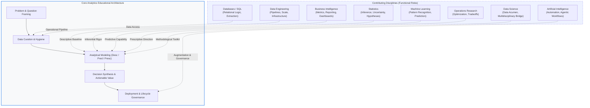
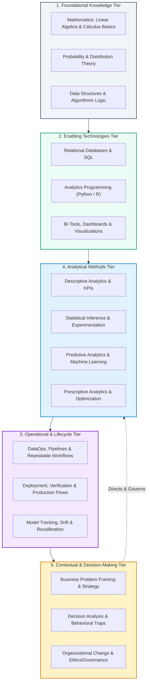
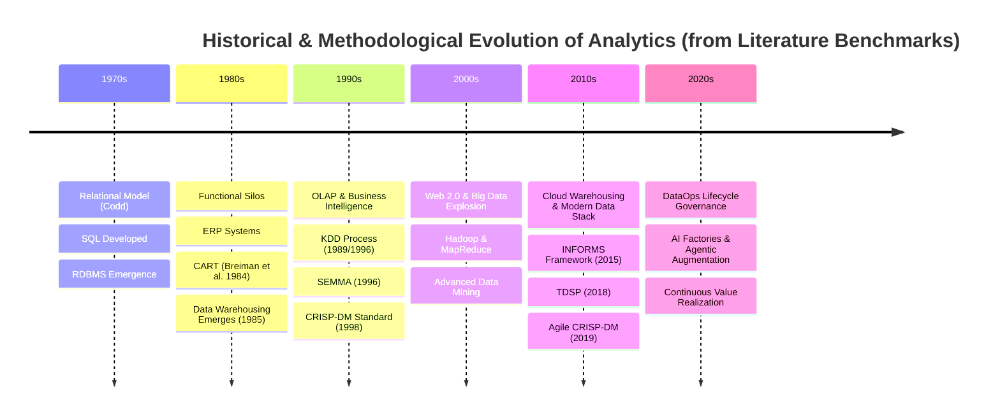
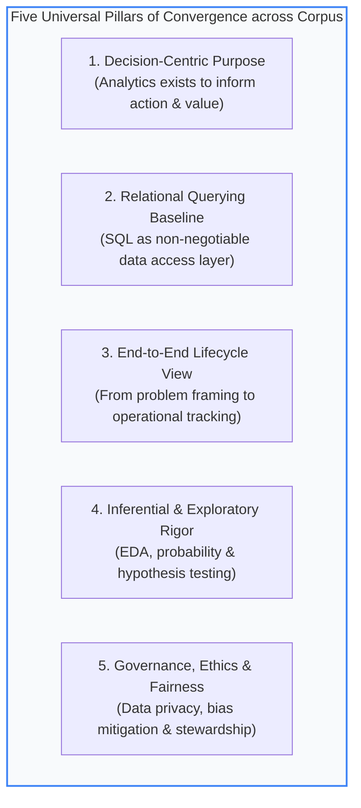
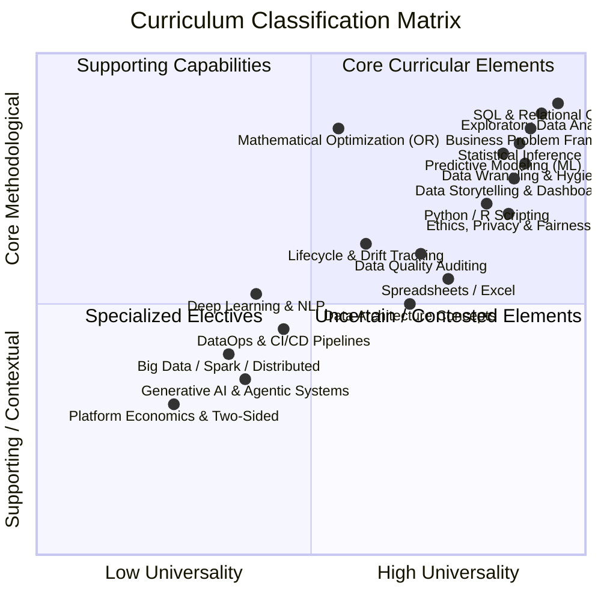
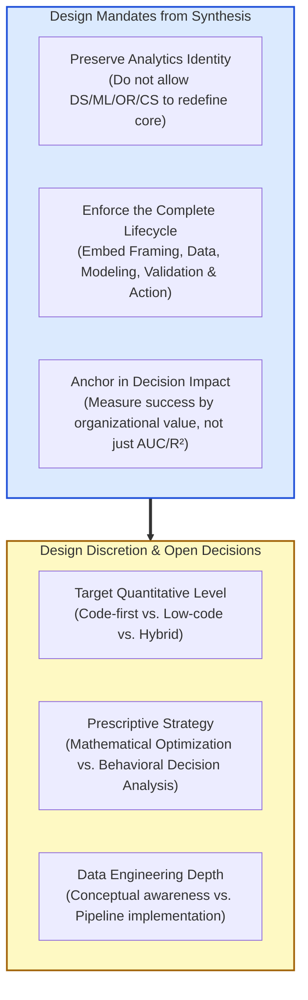

# Benchmark Synthesis

## 1. Scope and method

### 1.1 Scope of the investigation

This benchmark synthesis provides an independent, evidence-based analysis of the complete curriculum benchmark corpus located in `design/benchmarks/`. The investigation is designed to establish what the available authoritative, institutional, professional-learning, and literature-derived evidence collectively reveals regarding the identity, boundaries, competencies, knowledge architecture, learning progression, and practical orientation of **Analytics education**.

In strict compliance with the governing instructions established in `AGENTS.md`, the organizing perspective of this entire synthesis is **Analytics**. Contributing disciplines—including Machine Learning, Statistics, Operations Research and Optimization, Data Science, Data Engineering, Databases, Business Intelligence, and Artificial Intelligence—are examined strictly through the lens of their functional contributions to Analytics, rather than allowing the internal curricular logic or syllabus conventions of any contributing discipline to dictate the curricular architecture.

### 1.2 Corpus analyzed

The synthesis examined the complete set of 36 primary documents across the four canonical evidence families present in the repository:

1. **Authoritative benchmarks (`design/benchmarks/authoritative/`)**:
   - `acm-computing-competencies-undergraduate-data-science-2021.pdf`: ACM/IEEE-CS/AAAI/SIAM computing competencies for undergraduate data science programs.
   - `informs-analytics-framework-2024.pdf`: INFORMS Analytics Framework (IAF™), detailing the complete analytics lifecycle across seven domains.
   - `informs-cap-essentials-blueprint.pdf`: INFORMS Certified Analytics Professional Essentials (CAP-E) Exam Blueprint (2024).
   - `informs-cap-pro-blueprint.pdf`: INFORMS Certified Analytics Professional (CAP-P) Professional Exam Blueprint (2024).
   - `national-academies-data-science-for-undergraduates-2018.pdf`: National Academies of Sciences, Engineering, and Medicine consensus study report on undergraduate data science education and "data acumen."

2. **Institutional benchmarks (`design/benchmarks/institutional/`)**:
   - `berkeley-ai-business-strategy-applications.pdf`: UC Berkeley Haas Executive Education, AI Business Strategy and Applications.
   - `berkeley-data-c101-data-engineering.pdf`: UC Berkeley Data Science Undergraduate Studies, DATA C101: Data Engineering.
   - `berkeley-data-c102-data-inference-and-decisions.pdf`: UC Berkeley Data Science Undergraduate Studies, DATA C102: Data, Inference, and Decisions.
   - `cambridge-business-analytics.pdf`: University of Cambridge Judge Business School Executive Education, Business Analytics: Decision Making from Data.
   - `mit-cloud-and-devops.pdf`: MIT Professional Education, Cloud & DevOps: Continuous Transformation.
   - `mit-data-leadership.pdf`: MIT Professional Education, Data Leadership: Transforming Operations, Management, and Mindset.
   - `mit-data-science-and-machine-learning.pdf`: MIT Institute for Data, Systems, and Society (IDSS), Data Science and Machine Learning: Making Data-Driven Decisions.
   - `mit-designing-and-building-ai-products-and-services.pdf`: MIT Professional Education, Designing and Building AI Products and Services.
   - `mit-digital-platforms.pdf`: MIT Professional Education, Digital Platforms: Designing Two-Sided Markets from APIs to Feature Roadmaps.
   - `mit-machine-learning-modeling-and-simulation-principles.pdf`: MIT Professional Education, Machine Learning, Modeling, and Simulation Principles.
   - `mit-professional-certificate-data-engineering.pdf`: MIT xPRO, Professional Certificate in Data Engineering.
   - `mit-professional-certificate-data-science-and-analytics.pdf`: MIT xPRO, Professional Certificate in Data Science and Analytics.
   - `mit-quantitative-methods-in-systems-engineering.pdf`: MIT Professional Education, Quantitative Methods in Systems Engineering.
   - `mit-rapid-prototyping-methodologies.pdf`: MIT xPRO, Rapid Prototyping Methodologies for Commercial Application.
   - `pwc-data-and-analytics-academy.pdf`: PricewaterhouseCoopers (PwC) Nigeria Data & Analytics Academy curriculum.
   - `stanford-ai-strategy-governance.pdf`: Stanford Online, AI for Senior Executives: Strategy, Business Models, and Governance.
   - `usc-introduction-to-data-analytics.pdf`: USC Viterbi School of Engineering, ITP 249: Introduction to Data Analytics.
   - `ut-austin-agentic-ai-business-applications.pdf`: UT Austin McCombs / Great Learning, Agentic AI for Business Applications.
   - `warwick-foundations-of-data-analytics.pdf`: University of Warwick Department of Computer Science, CS909: Foundations of Data Analytics.

3. **Professional-learning benchmarks (`design/benchmarks/professional/`)**:
   - `datacamp.md`: Structured benchmark of DataCamp career tracks, skill tracks, and certifications (Data Analyst, Business Analyst, Associate Data Scientist, Data Scientist).
   - `pluralsight.md`: Structured benchmark of Pluralsight learning paths, role tracks, and certifications (Data Analytics Foundations, Data Science Foundations, Python for Data Analysis, Excel, Alteryx, Spark, DP-100, Generative AI).

4. **Literature-derived benchmarks (`design/benchmarks/literature-derived/`)**:
   - `conf-origen-y-evolucion-business-analytics.pdf`: Curated conference monograph on the historical origin, cognitive drivers, technological evolution, and organizational role of Business Analytics.
   - `dataops-01-the-problem.pdf` to `dataops-10-organization.pdf`: 10-part reference monograph on DataOps methodology, data strategy, lean/agile execution, data quality, leadership roles (CDO), and organizational design.

### 1.3 Methodological approach and evidence weighting

The analysis was executed through direct qualitative extraction, structural decomposition, and cross-source comparative synthesis across all 36 documents. Document content was inspected directly using native system extraction and optical analysis; no claims are based on superficial document titles, file names, or unverified marketing abstracts.

Evidence weighting was governed by qualitative triangulation across independent evidence families:
- Findings supported across multiple independent evidence families (e.g., authoritative frameworks converging with institutional course syllabi, professional role tracks, and literature-derived process models) are classified as high-confidence core evidence.
- Repeated claims originating from a single proprietary source, vendor ecosystem, or narrow institutional tradition were analyzed critically to distinguish generalizable educational principles from localized or commercial artifacts.
- When evidence families or specific curricula diverged (e.g., regarding mathematical depth, programming requirements, or the boundaries between data science and data engineering), the divergence was preserved and analyzed rather than artificially reconciled.

### 1.4 Statement of independence and corpus limitations

**Statement of independence:** In strict adherence to the task instructions, this synthesis was conducted completely independently. No existing synthesis documents produced by other LLM agents (such as `synthesis-chatgpt.md`, `synthesis-gemini.md`, or previous drafts) were opened, inspected, consulted, or referenced at any point during this analysis.

**Corpus limitations:**
- The corpus exhibits a noticeable distribution of document formats: several institutional artifacts are executive education brochures and professional development syllabi rather than full 4-year degree specifications.
- Literature-derived materials contain a heavy concentration in DataOps and agile data lifecycle management, reflecting a strong operational perspective that must be contextualized alongside foundational academic standards.
- In accordance with the corpus policy, no external web research was conducted to fill perceived gaps or resolve local uncertainties.

---

## 2. Analytics as an educational domain

### 2.1 The core identity and purpose of Analytics

Across the benchmark corpus, Analytics emerges not as a loose collection of computational algorithms or statistical formulas, but as a distinct, end-to-end discipline whose organizing purpose is **informing and improving decision-making, operational action, and organizational value creation through the systematic analysis of data**.

In the authoritative INFORMS Analytics Framework (IAF™) and its associated CAP blueprints (`informs-analytics-framework-2024.pdf`, `informs-cap-essentials-blueprint.pdf`), Analytics is formally defined across a seven-stage lifecycle:
1. Business Problem Framing
2. Analytics Problem Framing
3. Data
4. Methodology (Approach) Selection
5. Analytics/Model Development
6. Deployment
7. Analytics Solution Lifecycle Management

This framing is profoundly mirrored in the literature-derived process models (`dataops-03-methodologies.pdf`), which articulate the value chain as:
$$\text{Problema} \longrightarrow \text{Datos} \longrightarrow \text{Modelo} \longrightarrow \text{Soluci\acute{o}n} \longrightarrow \text{Decisi\acute{o}n} \longrightarrow \text{Acci\acute{o}n} \longrightarrow \text{Valor}$$
`dataops-03-methodologies.pdf` asserts an essential educational axiom: *"Un buen modelo no garantiza un buen proyecto de analítica. Puede ser técnicamente correcto y, aun así, no resolver el problema, no ser utilizado o no generar valor."* (A good model does not guarantee a good analytics project. It can be technically correct and yet fail to solve the problem, fail to be adopted, or fail to generate value.)

Similarly, the institutional benchmark from Cambridge Judge Business School (`cambridge-business-analytics.pdf`) centres its entire curriculum on *"Tomar decisiones a partir de los datos"* (Decision making from data), opening with cognitive decision traps and heuristics before introducing quantitative methods. At USC (`usc-introduction-to-data-analytics.pdf`), the core objective is to *"pose questions, collect relevant data, analyze data, interpret data and provide insights"* to make business decisions confidently.

### 2.2 Characteristic activities and expected learner capabilities

The activities that define Analytics education across the corpus can be organized around five primary capabilities:
1. **Translating Ambiguous Problems into Structured Inquiries:** The ability to move from an organizational symptom or strategic question to a well-defined analytical problem, explicitly identifying inputs, outputs, assumptions, constraints, and baseline performance (INFORMS Domains I & II; Cambridge Module 1).
2. **Curating and Wrangling Complex Data:** Locating, acquiring, cleaning, harmonizing, validating, and structuring data while recognizing data quality gaps, governance constraints, and privacy implications (INFORMS Domain III; Berkeley DATA C101; DataCamp; Pluralsight; Warwick CS909).
3. **Selecting and Developing Fit-for-Purpose Models:** Understanding the continuum of descriptive, diagnostic, predictive, and prescriptive methodologies, and choosing the appropriate technique based on the decision context rather than methodological novelty (INFORMS Domains IV & V; MIT PC Data Science & Analytics; Cambridge Modules 2, 5, 7).
4. **Evaluating, Validating, and Explaining Analytical Solutions:** Assessing not only algorithmic error metrics (e.g., $R^2$, RMSE, AUC) but also business validity, financial ROI, fairness/bias, and unintended secondary consequences (INFORMS Domain VI; National Academies 2018; DataCamp Data Scientist certification).
5. **Operationalizing Solutions and Managing Lifecycles:** Ensuring that insights are integrated into workflows, dashboards, or production decision systems, accompanied by ongoing performance tracking, model recalibration, and stakeholder training (INFORMS Domain VII; DataOps-06/09; MIT Data Leadership).

### 2.3 The relationship between technical and contextual knowledge

A recurring theme across all four evidence families is that technical competence without contextual grounding is insufficient for Analytics. While computer science programs prioritize computational complexity, algorithm design, and software architecture (as seen in `acm-computing-competencies-undergraduate-data-science-2021.pdf`), Analytics programs explicitly require **dual literacy**:
- **Contextual and domain understanding:** Understanding the operational environment, business objectives, stakeholder incentives, regulatory landscape, and human cognitive biases (`cambridge-business-analytics.pdf`, `conf-origen-y-evolucion-business-analytics.pdf`).
- **Technical and methodological capability:** Managing data formats, executing relational queries (SQL), performing statistical tests, applying machine learning algorithms, and configuring optimization solvers (`usc-introduction-to-data-analytics.pdf`, `warwick-foundations-of-data-analytics.pdf`, `datacamp.md`).

The literature benchmark on the origin and evolution of Business Analytics (`conf-origen-y-evolucion-business-analytics.pdf`) emphasizes that organizations require analytics precisely because modern operational complexity and data volume exceed human cognitive capacity, while human decision-makers are prone to subjective biases. Thus, Analytics serves as the formal bridge between raw information assets and human/organizational judgment.

### 2.4 Consensus, partial convergence, and unresolved tensions

- **Strong convergence:** Across all sources, Analytics is universally recognized as decision-driven, lifecycle-spanning, stakeholder-dependent, and requiring both relational data manipulation and statistical reasoning.
- **Partial convergence:** There is broad conceptual agreement that Analytics spans descriptive, predictive, and prescriptive methods; however, curricula vary sharply in how much prescriptive optimization (Operations Research) they include. Authoritative standards (INFORMS) and top-tier university programs (MIT xPRO, Cambridge) treat prescriptive analytics as indispensable, whereas commercial platforms (DataCamp, Pluralsight) focus overwhelmingly on descriptive metrics and predictive machine learning.
- **Unresolved tensions:** The benchmark corpus reflects ongoing debate regarding the necessity of coding. Institutional and professional offerings split between code-first paths (Python, R, SQL) and decision-first/no-code tracks (Cambridge Executive, MIT Data Leadership, Pluralsight Alteryx).

---

## 3. Analytics and contributing disciplines

In accordance with `AGENTS.md`, Analytics is the organizing educational perspective. Below is the cross-corpus analysis of the eight contributing disciplines, detailing the specific function each serves within Analytics education.



### 3.1 Data Science

- **Disciplinary perspective:** Data Science is broadly conceptualized as an interdisciplinary field integrating computing, mathematics, statistics, and domain knowledge to extract knowledge from complex data (ACM 2021; National Academies 2018).
- **Function within Analytics:** In an Analytics curriculum, Data Science provides the methodological mindset—termed "data acumen" by the National Academies (2018)—that combines mathematical modeling, exploratory data analysis, and algorithmic tools. However, while general Data Science education often focuses heavily on novel computational techniques, big-data system architecture, and algorithmic innovation (ACM 2021), Analytics re-anchors Data Science directly to organizational problem-solving, stakeholder alignment, and decision impact. Analytics uses Data Science methods as a toolkit to generate actionable answers rather than building data systems in the abstract.

### 3.2 Machine Learning

- **Disciplinary perspective:** A subfield of computer science and artificial intelligence focused on algorithms that learn from data to make predictions or decisions without being explicitly programmed (ACM ML Knowledge Area; MIT Machine Learning Modeling & Simulation).
- **Function within Analytics:** Within Analytics, Machine Learning is a core **predictive engine**. It provides learners with algorithmic techniques (classification, regression trees, random forests, support vector machines, neural networks) to detect non-linear patterns, forecast future outcomes, and estimate probabilities (INFORMS Domain V; Cambridge Module 5; MIT PC Data Science & Analytics Part 3; DataCamp; Warwick CS909). Curricularly, Analytics treats ML not as an end in itself, but as an intermediate step: the output of an ML model (e.g., predicted churn, failure probability) feeds into a decision model, an economic valuation, or an operational workflow.

### 3.3 Statistics

- **Disciplinary perspective:** The mathematical science of collecting, analyzing, interpreting, and presenting empirical data under conditions of uncertainty.
- **Function within Analytics:** Statistics provides the **epistemic foundation** of Analytics. It equips learners with the principles of probability distributions, sampling variability, hypothesis testing, confidence intervals, regression estimation, and causal inference (National Academies 2018; Berkeley DATA C102; INFORMS Domain IV; DataCamp; Pluralsight). In Analytics education, statistics ensures that findings are not spurious, provides rigorous quantification of risk and uncertainty, and underpins A/B testing and experimentation (Cambridge Module 4). It serves as the guardrail against unwarranted claims and decision traps.

### 3.4 Operations Research and Optimization

- **Disciplinary perspective:** The discipline that applies advanced analytical methods—mathematical programming, linear/nonlinear programming, integer programming, stochastic modeling, simulation, and queueing theory—to help make better decisions.
- **Function within Analytics:** Operations Research is the backbone of **prescriptive analytics**. While statistics and machine learning answer "what happened?" and "what will happen?", Operations Research answers the definitive analytics question: *"What should we do?"* under constraints of cost, capacity, time, and risk (INFORMS Domains IV & V; MIT PC Data Science & Analytics Part 2: Foundations of Optimization; MIT Quantitative Methods; Cambridge Module 7). In an Analytics curriculum, OR provides learners with the mathematical structures (objective functions, decision variables, constraint sets) required to translate predictions into optimal, actionable policies.

### 3.5 Data Engineering

- **Disciplinary perspective:** The software engineering discipline focused on designing, building, maintaining, and scaling data platforms, architectures, distributed pipelines, and storage systems (Berkeley DATA C101; MIT PC Data Engineering; Pluralsight Data Engineering).
- **Function within Analytics:** In Analytics education, Data Engineering serves an **enabling and operationalizing function**. Analytics learners do not require the full engineering depth of designing distributed compilers, low-level streaming engines, or container orchestrators; however, they require sufficient data engineering literacy to extract data from APIs and warehouses, write clean data transformation pipelines, understand schema normalization and data modeling, evaluate data pipeline latency, and collaborate effectively with data engineering teams (INFORMS Domain III; MIT Data Leadership; DataOps-08).

### 3.6 Databases

- **Disciplinary perspective:** The computer science and information systems field dedicated to data modeling, relational theory, database management systems (RDBMS), NoSQL stores, and structured querying.
- **Function within Analytics:** Databases and SQL represent the **foundational data access layer** of Analytics. As demonstrated across institutional courses (USC ITP 249; Warwick CS909; MIT Data Leadership Module 5) and professional benchmarks (DataCamp SQL Career/Skill Tracks; Pluralsight), SQL is an indispensable baseline tool. It enables analysts to inspect schemas, execute relational joins, filter and aggregate data, calculate business metrics, and enforce transactional data integrity. The historical overview in `conf-origen-y-evolucion-business-analytics.pdf` traces the very birth of business analytics to the emergence of RDBMS and SQL, which liberated data from proprietary application silos.

### 3.7 Business Intelligence

- **Disciplinary perspective:** The technology-driven process of analyzing business data and presenting actionable information to help executives, managers, and corporate end-users make informed business decisions, traditionally through reporting, OLAP, and interactive dashboards.
- **Function within Analytics:** Business Intelligence represents the **descriptive and diagnostic foundation** as well as the **primary visual communication interface** of Analytics (PwC Data & Analytics Academy; DataCamp; Pluralsight; `conf-origen-y-evolucion-business-analytics.pdf`). BI provides the frameworks for KPI definition, executive dashboarding, slice-and-dice data exploration, and automated enterprise reporting. Analytics builds upon BI by extending static or historical reporting into statistical modeling, predictive forecasting, and prescriptive optimization.

### 3.8 Artificial Intelligence

- **Disciplinary perspective:** The overarching domain of computer science concerned with building smart machines capable of performing tasks that typically require human intelligence, including deep learning, natural language processing, computer vision, and autonomous agentic systems.
- **Function within Analytics:** In modern Analytics curricula, AI appears in two distinct roles:
  1. *Advanced analytical capability:* Enabling unstructured data processing (text, speech, image data) to feed structured analytical models (Cambridge Module 6; Berkeley AI; UT Austin Agentic AI; Stanford AI Strategy).
  2. *Augmentation of the analytical workflow:* Utilizing generative AI and autonomous agents to automate data wrangling, code generation, exploratory synthesis, and report summarization, accompanied by critical human oversight regarding hallucination, bias, security, and governance (Pluralsight Generative AI for Data Science; Stanford Online; DataOps-06).

---

## 4. Recurring capabilities

A rigorous cross-source synthesis reveals nine primary learner capabilities that recur across the benchmark corpus. These groupings emerged organically from the evidence rather than being imposed from an a priori framework.

| Capability | Core Definition | Supporting Evidence & Families | Strength of Convergence | Key Variations & Nuances |
|---|---|---|---|---|
| **1. Problem & Question Framing** | Formulating clear, concise business questions; determining analytics amenability; aligning stakeholders; establishing baseline metrics and success criteria. | **Authoritative:** INFORMS Domains I & II (32% of CAP weight).<br/>**Institutional:** Cambridge M1; Stanford; Warwick.<br/>**Professional:** Pluralsight Data Analytics Foundations.<br/>**Literature:** DataOps-02/03. | **Universal / High** | Authoritative sources specify formal stakeholder alignment and business case modeling; professional courses emphasize tactical question decomposition. |
| **2. Data Acquisition, Wrangling & Curation** | Identifying data sources; acquiring data via SQL/APIs/files; cleaning, joining, harmonizing; handling missingness and type errors. | **Authoritative:** INFORMS Domain III (19% weight); National Academies; ACM DG.<br/>**Institutional:** Berkeley C101; USC; Warwick; PwC.<br/>**Professional:** DataCamp Python/R/SQL; Pluralsight.<br/>**Literature:** Conf-Origen; DataOps-03/09. | **Universal / High** | Technical tracks emphasize SQL and pandas scripting; executive tracks focus on data inventory, governance, and architecture evaluation. |
| **3. Exploratory Analysis & Profiling** | Calculating univariate and bivariate summary statistics; profiling distributions; detecting outliers; visualizing relationships. | **Authoritative:** National Academies (Data Acumen); ACM AP; INFORMS Task 3.6.<br/>**Institutional:** Warwick; MIT PC DSA; PwC Day 2.<br/>**Professional:** DataCamp EDA; Pluralsight EDA.<br/>**Literature:** DataOps-03 (KDD/CRISP-DM exploration). | **Universal / High** | Strong consensus on EDA as an obligatory gateway before any advanced modeling or inferential claims. |
| **4. Statistical Inference & Experimentation** | Formulating hypotheses; testing significance; calculating confidence intervals; designing A/B experiments; distinguishing correlation from causation. | **Authoritative:** National Academies; ACM; INFORMS Domain IV.<br/>**Institutional:** Berkeley C102; Cambridge M4; MIT PC DSA M2–3; Warwick.<br/>**Professional:** DataCamp Statistical Experimentation; Pluralsight Intro Stats.<br/>**Literature:** DataOps-03. | **Universal / High** | Academic benchmarks demand formal probability and hypothesis testing; professional tracks focus on practical A/B test interpretation. |
| **5. Predictive Modeling & Evaluation** | Selecting, training, and tuning predictive models (linear/logistic regression, CART, random forests, ensembles, basic neural nets); evaluating with cross-validation. | **Authoritative:** INFORMS Domain V; ACM ML; National Academies.<br/>**Institutional:** Cambridge M5–6; MIT PC DSA M5–7, 14–15; Warwick; PwC Day 3.<br/>**Professional:** DataCamp Associate DS; Pluralsight ML.<br/>**Literature:** Conf-Origen (CART 1984); DataOps-08. | **Universal / High** | Data science programs emphasize algorithmic tuning and deep architectures; analytics programs prioritize model interpretability and validation. |
| **6. Prescriptive Modeling & Optimization** | Formulating decision problems mathematically; defining decision variables, constraints, and objective functions; evaluating trade-offs under uncertainty. | **Authoritative:** INFORMS Domains IV & V (Methodology & Model Development).<br/>**Institutional:** MIT PC DSA Part 2 (5 modules on Optimization); Cambridge M7; MIT Quantitative Methods.<br/>**Professional:** Largely absent in DataCamp/Pluralsight.<br/>**Literature:** DataOps-03. | **Partial / Bimodal** | Highly emphasized in authoritative and top-tier university analytics programs; virtually neglected in commercial coding platforms. |
| **7. Validation, Bias & Risk Assessment** | Validating technical models against business reality; assessing ethical implications, algorithmic fairness, training/test leakage, and unintended side effects. | **Authoritative:** INFORMS Task 5.3, Domain VI & VII; National Academies; ACM DPSIA/PR.<br/>**Institutional:** Berkeley C102; Cambridge M1/M9; Stanford; MIT PC DSA M16.<br/>**Professional:** DataCamp DS Certification; Pluralsight Ethics.<br/>**Literature:** DataOps-01/09. | **High / Growing** | Authoritative benchmarks require systematic lifecycle auditing for side effects; modern institutional programs embed AI governance and fairness. |
| **8. Communication & Data Storytelling** | Designing intuitive charts, interactive dashboards, and executive reports; translating analytical complexity into actionable recommendations. | **Authoritative:** INFORMS Task 5.6/6.2; National Academies; ACM PR.<br/>**Institutional:** USC; Cambridge; PwC Day 1–3; MIT Data Leadership.<br/>**Professional:** DataCamp Data Communication; Pluralsight Practical Application.<br/>**Literature:** DataOps-02/03. | **Universal / High** | Professional platforms test recorded presentations and dashboard creation; executive programs emphasize strategic briefing. |
| **9. Operational Deployment & Lifecycle Management** | Transitioning models into production; establishing repeatable workflows (DataOps/DevOps); tracking performance drift; model recalibration. | **Authoritative:** INFORMS Domains VI & VII (17% weight).<br/>**Institutional:** Berkeley C101; MIT Data Leadership; MIT Cloud & DevOps.<br/>**Professional:** Pluralsight Data Science Foundations; DataCamp Databricks/Docker.<br/>**Literature:** DataOps complete series (01–10). | **Moderate to High** | Comprehensively articulated in INFORMS and DataOps literature; treated as advanced or elective in standard university introductory courses. |

---

## 5. Knowledge architecture

The benchmark corpus supports a multi-layered knowledge architecture that organizes Analytics education into five functional tiers:



### 5.1 Foundational knowledge
- **Probability and Distribution Theory:** Understanding randomness, probability mass/density functions, normal and skewed distributions, expectations, variance, and joint probabilities (National Academies; Berkeley C102; MIT PC DSA Module 2; Warwick CS909).
- **Mathematical Literacy:** Essential linear algebra (matrix representations, dot products, dimensionality reduction) and optimization basics (derivatives, loss functions, gradients) needed to comprehend model behavior (ACM PDA; Warwick CS909; National Academies).
- **Core Computational Logic:** Variables, loops, conditional branching, data structures (arrays, dictionaries, lists, tables), and algorithmic complexity (ACM CCF/PDA; DataCamp; Pluralsight).

### 5.2 Enabling knowledge
- **Relational Data Modeling and Querying (SQL):** Schema design, entity-relationship models, primary/foreign keys, joins, aggregations, window functions, and subqueries (USC; Warwick; DataCamp SQL; INFORMS Domain III; Conf-Origen).
- **Analytics Programming Environments:** Working within interactive environments (Jupyter, RStudio, script execution) using specialized tabular and statistical libraries (pandas, NumPy, tidyverse) (DataCamp; Pluralsight; Warwick).
- **Data Architecture and Ingestion:** File structures (CSV, JSON, Parquet), APIs, web scraping, data warehouses, data lakes, and modern data stack paradigms (Cambridge M2–3; MIT PC Data Engineering; DataOps-02; Conf-Origen).

### 5.3 Analytical methods
- **Descriptive and Diagnostic Methods:** Summary statistics, data profiling, anomaly detection, cohort analysis, and root-cause decomposition (INFORMS Domain IV; Cambridge M2; DataCamp).
- **Inferential and Experimental Methods:** Hypothesis testing ($t$-tests, chi-square, ANOVA), confidence intervals, effect size calculation, A/B testing design, and causal inference foundations (Cambridge M4; Berkeley C102; Pluralsight).
- **Predictive Machine Learning:** Supervised learning algorithms for classification and regression (linear/logistic regression, decision trees, random forests, gradient boosting, SVM, basic neural nets), unsupervised clustering ($k$-means, hierarchical), and cross-validation techniques (INFORMS Domain V; MIT PC DSA; Cambridge M5–6; Warwick).
- **Prescriptive Optimization:** Linear programming, integer programming, sensitivity analysis, objective function formulation, decision trees under uncertainty, and simulation modeling (INFORMS Domain IV/V; MIT PC DSA Part 2; Cambridge M7; MIT Quantitative Methods).

### 5.4 Contextual and decision-oriented knowledge
- **Business Problem Formulation:** Translating organizational objectives into quantifiable metrics and analytical models; defining business cases, ROI, and success measures (INFORMS Domain I/II; DataOps-02).
- **Cognitive and Behavioral Decision Traps:** Understanding heuristics, confirmation bias, overfitting to past data, and behavioral economics nudges (Cambridge M1 & M8; Conf-Origen).
- **Ethics, Privacy, and Governance:** Data protection regulations, anonymization ($k$-anonymity, differential privacy), algorithmic bias, explainability (SHAP/interpretability), and corporate data stewardship (National Academies; ACM DPSIA/PR; Stanford; Berkeley C102; Warwick).

### 5.5 Specialized or elective knowledge
- **Deep Learning and Generative AI:** Transformers, large language models, agentic workflows, and neural network architectures for unstructured data (Pluralsight GenAI; Stanford; UT Austin; Berkeley AI).
- **Distributed Big Data Computing:** Apache Spark, cluster management, large-scale streaming, and cloud orchestration (ACM BDS; Pluralsight Spark; MIT Cloud & DevOps).
- **Platform Dynamics and Two-Sided Markets:** Network effects, API ecosystem strategies, and multi-sided platform governance (MIT Digital Platforms).

---

## 6. Learning progression

### 6.1 Explicit vs. structural vs. analytically inferred progression

The benchmark corpus demonstrates three distinct levels of learning progression:
1. **Explicit progression (Provider-stated):**
   - Professional platforms explicitly prescribe zero-prerequisite onboarding progressing from syntax to analysis to modeling: DataCamp explicitly states: `Introduction to Python` $\rightarrow$ `Intermediate Python` $\rightarrow$ `Data Manipulation with pandas` $\rightarrow$ `EDA & Statistics` $\rightarrow$ `Machine Learning` (`datacamp.md`).
   - Pluralsight states that Data Science Foundations assumes 1–3 years of prior analyst or engineer experience, positioning Data Science as an explicit post-analytics progression (`pluralsight.md`).
2. **Structural progression (Curricular architecture):**
   - University and institutional curricula uniformly structure courses by moving from foundational data manipulation and relational databases to statistical inference, then predictive machine learning, and finally optimization and capstone decision projects (USC; Warwick; MIT PC DSA; Berkeley C101 $\rightarrow$ C102).
   - INFORMS structures the entire profession into a sequential lifecycle from Problem Framing to Deployment and Lifecycle Management (Domains I through VII).
3. **Analytically inferred progression:**
   - Across the corpus, cognitive progression moves systematically across four dimensions:
     - From **data handling** to **data interpretation**
     - From **simple descriptive summaries** to **multivariate predictive and prescriptive models**
     - From **isolated technical scripts** to **integrated business workflows**
     - From **model evaluation against statistical metrics** to **solution evaluation against organizational impact**

### 6.2 Competing progression models: Code-First vs. Decision-First

The corpus reveals a prominent structural tension between two competing pedagogical paradigms:

```
[Model A: Code-First / Tool-Centric Progression]
Syntax & Environment  ──>  Data Wrangling (SQL/pandas)  ──>  Statistical Models  ──>  ML / Algorithms  ──>  Business Case Projects
(Exemplified by: DataCamp, Pluralsight, Warwick CS909, USC ITP 249)

[Model B: Decision-First / Concept-Centric Progression]
Business Problem Framing  ──>  Cognitive Biases & KPIs  ──>  Data Architecture  ──>  Modeling Methods  ──>  Operational Governance
(Exemplified by: Cambridge Judge, INFORMS IAF™, MIT Data Leadership, Stanford Executive)
```

- **Model A (Code-First):** Begins with programming languages (Python, R, SQL) and low-level data structures. Learners build competence by manipulating data arrays and writing queries before encountering complex business problems. The primary risk of this model is that learners master coding techniques without developing business acumen or question-framing capability.
- **Model B (Decision-First):** Begins with strategic context, decision pitfalls, problem formulation, and stakeholder objectives. Methodologies and tools are introduced strictly as mechanisms to solve identified organizational dilemmas. The primary risk of this model is that learners may understand strategic concepts but lack the practical data wrangling and implementation skills required to execute analysis independently.

An authentic Analytics curriculum must reconcile this tension by integrating problem framing and data manipulation from the earliest learning stages, rather than segregating them into disconnected phases.

---

## 7. Practice and authentic analytical work

### 7.1 Forms of practice across the corpus

Practice is universally recognized as the central vehicle of learning in Analytics education, manifesting in six primary pedagogical forms:
1. **Interactive In-Browser Exercises:** Granular, auto-graded coding challenges focusing on syntactic mastery and immediate feedback (DataCamp; Pluralsight).
2. **Realistic Messy Datasets:** Utilizing non-synthetic, imperfect datasets containing missing values, incorrect formatting, duplicated records, and ambiguous variables (Warwick CS909; USC ITP 249; National Academies 2018; DataCamp projects on Netflix, crime, public schools).
3. **Real-World Organizational Case Studies:** In-depth case analyses of prominent corporate deployments (e.g., Netflix recommendation system and *House of Cards* commissioning, Google Ara, Ford global data simulator, UPS routing, JetBlue data stack, General Electric failed cloud transformation) used to explore strategic trade-offs, architecture choices, and operational failures (Cambridge; MIT Data Leadership; MIT Cloud & DevOps; Conf-Origen).
4. **End-to-End Capstone Projects:** Comprehensive projects requiring learners to start from an open-ended business challenge, acquire and clean data, formulate and calibrate models, and produce actionable stakeholder recommendations (INFORMS Capstone requirements; MIT PC DSA; Cambridge; Warwick).
5. **Authentic Professional Assessments:** Timed practical exams requiring business problem review, SQL data validation, metric computation, and recorded oral presentations to business stakeholders (DataCamp Data Analyst Associate & Data Scientist certifications; INFORMS CAP exams).
6. **Simulated Production Environments:** Cloud labs, containerized environments, and CI/CD pipelines simulating live enterprise infrastructure (MIT PC Data Engineering; Pluralsight Spark/Azure labs; MIT Cloud & DevOps).

### 7.2 Pedagogical functions of practice

The benchmark corpus demonstrates that practice serves three critical pedagogical functions in Analytics:
- **Practice as the organizing mechanism (not mere reinforcement):** The National Academies (2018) report on Data Science education explicitly warns against teaching theory in the abstract and relegating practice to end-of-term exercises. Instead, real-world data and problems must drive the introduction of concepts to expose the fundamental limitations and assumptions of mathematical and computational tools.
- **Cognitive calibration and error recognition:** Working with authentic data forces learners to confront data quality gaps, outliers, non-normal distributions, and multicollinearity, teaching them that real-world data rarely conforms to textbook distributions (`dataops-09-data-quality.pdf`; INFORMS Task 3.6).
- **Bridging the transfer gap to professional action:** Authentic practice prepares learners to defend analytical findings before skeptical stakeholders, articulate model assumptions and limitations, and understand how technical solutions integrate into organizational workflows (INFORMS Tasks 5.6 & 6.2; DataCamp Data Scientist presentation requirement).

---

## 8. Tools and technologies

### 8.1 Durable capabilities vs. ephemeral tools

A critical analytical distinction emerging from the corpus is the boundary between **durable conceptual capabilities** and **ephemeral tool implementations**.

```
DURABLE CAPABILITIES (Enduring Curricular Core)
├── Relational Logic & Set-Based Operations (Joining, filtering, aggregating, projecting)
├── Exploratory Data profiling & Distributional Thinking (Variance, central tendency, anomalies)
├── Formulating Optimization Models (Objective functions, decision variables, constraint boundaries)
├── Model Validation & Generalization (Overfitting control, cross-validation, loss evaluation)
├── Translating Organizational Questions into Analytical Frameworks
└── Ethical Oversight & Algorithmic Fairness (Mitigating bias, protecting individual privacy)
      │
      ▼ (Operationalized Through)
EPHEMERAL / ENABLING TOOLS (Interchangeable Implementations)
├── Query Engines: SQL, PostgreSQL, SQLite, BigQuery, Snowflake
├── Scripting & Tabular Libraries: Python (pandas, NumPy), R (tidyverse, dplyr)
├── Statistical & ML Packages: scikit-learn, statsmodels, Weka, PyTorch, TensorFlow
├── BI & Dashboarding Suites: Tableau, Power BI, Excel, Metabase
└── Infrastructure & Pipeline Tools: Docker, Git, Alteryx, Spark, Airflow, dbt
```

### 8.2 Technology landscape synthesized from benchmarks

1. **SQL (Structured Query Language):**
   - *Status:* **Universal Core**. SQL is the single most recurring technology across all four evidence families (USC, Warwick, Cambridge, MIT Data Leadership, DataCamp, Pluralsight, Conf-Origen, DataOps).
   - *Curricular role:* Non-negotiable baseline for data access, schema exploration, table joins, data hygiene, and business metric computation.
2. **Python and R:**
   - *Status:* **Universal Analytical Languages**.
   - *Curricular role:* Python dominates institutional and professional tracks that bridge into machine learning, deep learning, and data engineering (DataCamp, Pluralsight, MIT xPRO, Warwick). R retains strong authoritative and institutional presence for specialized statistical modeling, exploratory analysis, and academic data inference (DataCamp, Pluralsight, Warwick). Both serve as primary environments for scripting end-to-end data workflows.
3. **Spreadsheets (Microsoft Excel):**
   - *Status:* **Enduring Foundational Interface**.
   - *Curricular role:* Despite being low-tech, Excel appears prominently in INFORMS (Task 4.4.2 explicitly tests *"the strengths of a spreadsheet analytics model"*), USC (ITP 249), PwC Academy (Excel as primary prerequisite), and Pluralsight (dedicated Excel for Data Analysts path). Excel serves as the ubiquitous corporate baseline for quick calculations, financial modeling, and business prototyping.
4. **Business Intelligence Platforms (Power BI, Tableau):**
   - *Status:* **Widely Recurring Enabling Tools**.
   - *Curricular role:* Pervasive across professional-learning tracks and corporate academies (PwC, DataCamp, Pluralsight) for dashboard development, KPI reporting, and stakeholder delivery. However, authoritative academic standards (ACM, National Academies) treat them as optional applications of visual design principles rather than standalone core competencies.
5. **DataOps, Containers & Cloud Platforms (Docker, Git, AWS, Azure, Databricks):**
   - *Status:* **Operational Specialization / Enabling Layer**.
   - *Curricular role:* Prominently featured in modern institutional curricula (MIT Cloud & DevOps; MIT Data Engineering; Berkeley C101), literature benchmarks (DataOps series), and advanced certification paths (Pluralsight DP-100). They provide the execution environment for scalable, reproducible data pipelines.

---

## 9. Authoritative, institutional, and professional perspectives

A cross-family comparison between the authoritative frameworks, institutional curricula, and professional-learning benchmarks reveals significant structural convergence alongside sharp divergences in emphasis and delivery:

| Dimension | Authoritative Benchmarks (INFORMS, ACM, National Academies) | Institutional Benchmarks (Universities, Executive Programs, PwC) | Professional Benchmarks (DataCamp, Pluralsight) |
|---|---|---|---|
| **Primary Organizing Principle** | End-to-end professional lifecycle; foundational disciplinary competencies; enduring knowledge. | Market-facing programs; executive decision impact vs. technical engineering certificates. | Immediate job role readiness (Data Analyst, Data Scientist); task automation; tool fluency. |
| **Problem Framing & Scoping** | **Massive emphasis:** INFORMS allocates 32% of certification weight to Business and Analytics Problem Framing. | **Strong emphasis:** Executive programs (Cambridge, Stanford, MIT) begin with problem definition and strategic alignment. | **Minimal:** Typically compressed into a single introductory course or practical prompt; focus shifts rapidly to coding. |
| **Mathematical & Methodological Depth** | **High & balanced:** Formal probability, calculus/linear algebra, statistical inference, and mathematical optimization. | **Variable:** Deep mathematical inference in undergraduate majors (Berkeley C102); applied/conceptual in executive programs. | **Applied / Pragmatic:** Focuses on calling library functions (`fit`, `predict`), interpreting output metrics, and avoiding syntactic errors. |
| **Prescriptive Analytics & OR** | **Core component:** INFORMS explicitly balances descriptive, predictive, and prescriptive methodologies. | **Present in elite programs:** MIT PC DSA features 5 optimization modules; Cambridge includes prescriptive decision analysis. | **Virtually absent:** Commercial tracks focus almost exclusively on descriptive reporting and predictive ML. |
| **Role of Programming** | A core computational competency, but subordinate to problem framing, conceptual understanding, and data acumen. | Split between code-intensive undergraduate/technical paths and zero-code executive strategic tracks. | **Central spine:** Programming syntax and in-browser coding exercises are the primary vehicle of all instruction. |
| **Lifecycle & Deployment** | **Explicitly mandatory:** INFORMS Domains VI & VII govern deployment validation, training, drift, and maintenance. | Covered heavily in specialized certificates (MIT Data Engineering, Cloud & DevOps) and touched upon in capstones. | Covered in specialized certification paths (DP-100, Spark), but largely missing from general analyst tracks. |

### Synthesis of family contributions:
- **Authoritative benchmarks** provide the **architectural spine**: they ensure that the curriculum covers the complete lifecycle (framing, data, methodology, modeling, deployment, lifecycle governance) and maintains rigorous disciplinary identity without collapsing into a coding bootcamp.
- **Institutional benchmarks** provide **curricular operationalization**: they show how elite institutions package analytics for different audiences—distinguishing between the deep inferential rigor needed by technical analysts (Berkeley DATA C102, Warwick CS909) and the strategic judgment needed by decision-makers (Cambridge, Stanford, MIT Data Leadership).
- **Professional benchmarks** provide **granular task workflows**: they demonstrate how abstract competencies are operationalized into daily technical tasks (data wrangling in pandas, querying in PostgreSQL, building reproducible pipelines) and establish current market expectations for entry-level analyst employability.

---

## 10. Literature-derived perspectives

The literature-derived corpus—comprising the historical monograph on the origin and evolution of Business Analytics (`conf-origen-y-evolucion-business-analytics.pdf`) and the 10-part DataOps monograph (`dataops-01` to `10`)—adds critical operational, organizational, and historical dimensions that enrich the other evidence families:



### 10.1 Key contributions of the literature benchmarks
1. **The Historical Imperative of Analytics:**
   `conf-origen-y-evolucion-business-analytics.pdf` provides an invaluable historical trajectory. It demonstrates that Analytics did not appear spontaneously, but evolved through clear technological and organizational phases:
   - *Phase 1 (Data capture & silos):* RDBMS and SQL liberated data from paper records into relational tables.
   - *Phase 2 (Enterprise integration):* ERP, SCM, and CRM integrated cross-functional data, but transactional systems could not support heavy analytical queries.
   - *Phase 3 (Analytical aggregation & reporting):* Data Warehouses and OLAP enabled multidimensional business intelligence and historical reporting.
   - *Phase 4 (Algorithmic discovery):* Statistical learning algorithms (e.g., CART in 1984) and Data Mining automated pattern detection.
   - *Phase 5 (Big Data & the Cloud):* Distributed computing (Hadoop, Spark) and cloud architectures accommodated the 4Vs (volume, velocity, variety, veracity).
   - *Phase 6 (The Modern Data Stack & DataOps):* Decoupled storage and compute (Snowflake, BigQuery), automated ELT pipelines (dbt, Fivetran), and continuous data governance.
   This history proves that Analytics is fundamentally an evolving organizational capability designed to overcome human cognitive limitations and data silos.
2. **The "Value Realization Chain" and Methodology Evolution:**
   `dataops-03-methodologies.pdf` traces the methodological progression of data projects over four decades:
   $$\text{KDD (1989)} \longrightarrow \text{CRISP-DM (1998)} \longrightarrow \text{ASUM-DM (2014)} \longrightarrow \text{INFORMS (2015)} \longrightarrow \text{TDSP (2018)} \longrightarrow \text{DataOps (2020)}$$
   This evolution illustrates a critical shift: early methodologies (KDD, SEMMA) focused strictly on *data mining and knowledge discovery inside databases*. Intermediate frameworks (CRISP-DM) introduced *business understanding*. Modern frameworks (INFORMS, TDSP, DataOps) view analytics as a *continuous, collaborative software- and product-lifecycle process* that must directly deliver measurable organizational value.
3. **DataOps and Lean/Agile Execution:**
   `dataops-04` through `dataops-06` establish that high failure rates in analytics projects (estimates in the literature benchmark cite up to 80% of data science projects failing to deliver business impact) stem from operational silos, manual deployments, and poor data quality. By integrating Lean Thinking (eliminating waste, reducing cycle times), Agile collaboration (short iterations, continuous feedback), and DevOps principles (automated testing, CI/CD, version control), DataOps provides the operational framework required to make analytical solutions reliable and repeatable.
4. **Organizational and Leadership Context:**
   `dataops-07`, `08`, and `10` provide explicit models for analytics organizational structures (centralized Centers of Excellence vs. decentralized embedded pods vs. hybrid hub-and-spoke federations) and define the distinct, complementary roles of the Chief Data/Analytics Officer (CDO/CAO), Data Engineer, Data Scientist, and Business Analyst.

### 10.2 Distinctive boundaries and non-generalizable concentrations
While the literature-derived benchmarks provide profound operational depth, they also present concentrated perspectives that must not distort general curriculum design:
- *Over-concentration on DataOps tooling:* The DataOps monographs focus intensely on CI/CD pipelines, automated testing harnesses, and software engineering practices. While vital for enterprise operationalization, turning an introductory Analytics curriculum into an intensive DevOps course would violate `AGENTS.md` by substituting software engineering for analytical reasoning.
- *Enterprise corporate bias:* Both the historical monograph and the DataOps series assume large-scale enterprise environments with complex legacy architectures (ERP, SAP) and dedicated CDO offices. An educational framework must remain applicable to small-scale, public sector, and entrepreneurial contexts as well.

---

## 11. Areas of convergence

The synthesis reveals five fundamental areas where evidence strongly converges across all four evidence families:



1. **The Decision-Centric Purpose of Analytics:**
   - *Convergence:* INFORMS, National Academies, Cambridge, Warwick, USC, PwC, DataCamp, Pluralsight, and the DataOps series all agree that Analytics is defined by its connection to decision-making, organizational action, and measurable value.
   - *Evidence strength:* Flawless cross-family consensus. No benchmark defines Analytics merely as theoretical mathematics or pure coding; all demand alignment with real-world problems.
2. **Relational Querying and SQL as Non-Negotiable Baseline:**
   - *Convergence:* SQL appears across every institutional syllabus, professional career track, literature history, and authoritative standard as the foundational language for data extraction, manipulation, and metric computation.
   - *Evidence strength:* Universal. Even tracks that differ on whether Python or R is preferable converge completely on SQL.
3. **The End-to-End Lifecycle Perspective:**
   - *Convergence:* Analytics cannot be reduced to isolated model building. All four families recognize a multi-stage lifecycle encompassing problem definition, data preparation, modeling, validation, deployment, and ongoing monitoring (INFORMS Domains I–VII; CRISP-DM/DataOps in literature; Pluralsight lifecycle courses; Cambridge end-to-end projects).
4. **Exploratory Data Analysis and Inferential Foundations:**
   - *Convergence:* EDA, summary profiling, distribution analysis, visualization, and basic hypothesis testing form the universal prerequisite before any advanced predictive or machine learning techniques are applied (National Academies; ACM AP; MIT PC DSA; DataCamp; Pluralsight).
5. **Ethics, Data Privacy, and Algorithmic Fairness:**
   - *Convergence:* Modern benchmarks universally insist that ethical considerations—including data privacy, anonymization, protection of sensitive attributes, and detection of algorithmic bias—must be integrated into analytical training (National Academies Recommendation 2.4; ACM DPSIA/PR; Stanford; Cambridge M9; Berkeley C102; INFORMS Task 6.1.2).

---

## 12. Areas of disagreement or uncertainty

Rather than forcing artificial unanimity, the evidence reveals five major areas of substantive curricular disagreement and structural divergence:

### 12.1 The role and depth of Prescriptive Analytics (Optimization)
- **Disagreement:** Authoritative benchmarks (INFORMS Domains IV & V) and elite university programs (MIT PC DSA Part 2; Cambridge M7; MIT Systems Engineering) position mathematical optimization and Operations Research as an essential, co-equal pillar of Analytics. In sharp contrast, commercial professional-learning platforms (DataCamp, Pluralsight) and corporate academies (PwC) omit prescriptive mathematical optimization almost entirely, equating advanced analytics almost exclusively with predictive machine learning.
- **Evidence divide:** Authoritative / Academic vs. Commercial Professional Platforms.

### 12.2 Programming expectations: Code-First vs. Low-Code / Decision-First
- **Disagreement:** Technical university courses (Berkeley C101/C102, Warwick CS909, USC ITP 249) and platforms like DataCamp require substantial programming from day one (Python, R, command-line bash). Conversely, executive university programs (Cambridge Judge, MIT Data Leadership, Stanford) explicitly advertise that *no programming is required*, relying instead on spreadsheets, conceptual frameworks, and low-code demonstration tools (TensorFlow visualizers, Alteryx).
- **Evidence divide:** Undergraduate / Technical Certifications vs. Executive / Decision-Maker Education.

### 12.3 The curricular placement of Data Engineering and Platform Infrastructure
- **Disagreement:** To what extent must an Analytics curriculum teach data engineering? Berkeley (DATA C101), MIT (PC Data Engineering), and the DataOps literature argue that modern analysts cannot function without mastering data pipeline construction, containerization (Docker), and orchestration. Conversely, authoritative standards (INFORMS, National Academies) and commercial analyst tracks treat data engineering infrastructure as a separate, adjacent discipline, requiring analysts only to understand data architectures, query existing systems, and assess data quality.
- **Evidence divide:** Systems Engineering / DataOps Advocates vs. Applied Decision / Business Analytics Frameworks.

### 12.4 Mathematical formalism vs. Applied heuristic literacy
- **Disagreement:** Academic data science standards (ACM 2021; National Academies 2018; Berkeley C102) mandate formal mathematical prerequisites—calculus, linear algebra, and mathematical statistics. Professional and corporate benchmarks (DataCamp, Pluralsight, PwC) require only high school math and teach statistical concepts intuitively through code execution and visualization.
- **Evidence divide:** Computer Science / Mathematical Statistics Departments vs. Professional Workforce Training Providers.

### 12.5 Defining "Prescriptive" action: Mathematical Programming vs. Behavioral Nudges
- **Disagreement:** When prescriptive analytics is taught, how is it operationalized? MIT and INFORMS define prescriptive analytics through mathematical programming, linear/integer optimization, and objective function optimization under constraints. Cambridge Judge Business School (Modules 7 & 8) operationalizes prescriptive analytics through decision trees, scenario simulation, and behavioral economics nudges (countering human cognitive biases).
- **Evidence divide:** Operations Research / Engineering Tradition vs. Business Administration / Behavioral Economics Tradition.

---

## 13. Core, supporting, specialized, and uncertain elements

Based on qualitative evidence weighting across the complete 36-document corpus, major curriculum elements are classified into four analytical categories:



### 13.1 Core elements
*Criteria: Strongly supported across multiple independent evidence families and essential to preserving the identity of Analytics.*
- **Business & Analytics Problem Framing:** Scoping questions, stakeholder alignment, identifying inputs/outputs, establishing baseline performance and success metrics (INFORMS Domains I & II; Cambridge; DataOps-02/03).
- **SQL & Relational Data Manipulation:** Querying, filtering, aggregations, relational joins, table creation, and business metric derivation (USC; Warwick; DataCamp; Pluralsight; INFORMS Domain III; Conf-Origen).
- **Exploratory Data Analysis (EDA) & Profiling:** Summary statistics, data distributions, outlier detection, and correlation analysis (National Academies; ACM AP; DataCamp; Pluralsight; Warwick).
- **Statistical Inference & Experimentation:** Probability foundations, hypothesis testing, confidence intervals, A/B testing design, and distinguishing association from causation (National Academies; Berkeley C102; Cambridge; DataCamp; Pluralsight).
- **Supervised Predictive Modeling:** Linear and logistic regression, decision trees (CART), random forests, cross-validation, and performance evaluation metrics (INFORMS Domain V; MIT PC DSA; Cambridge; DataCamp; Warwick).
- **Analytical Communication & Data Storytelling:** Visual charts, interactive dashboard design, executive briefing, and translating technical outputs into actionable decisions (INFORMS Task 5.6/6.2; PwC; DataCamp; Pluralsight; USC).
- **Ethics, Privacy & Algorithmic Fairness:** Data privacy standards, anonymization, bias auditing in predictive models, and responsible analytics governance (National Academies; ACM DPSIA/PR; Stanford; Cambridge; Berkeley C102).

### 13.2 Supporting elements
*Criteria: Clearly valuable and necessary to enable core capabilities, but performing a functional support role rather than defining curricular identity.*
- **Analytics Programming Foundations (Python / R):** Data structures, loops, functions, environment setup, and tabular packages (pandas, NumPy, tidyverse) (DataCamp; Pluralsight; Warwick).
- **Data Quality Auditing & Hygiene:** Techniques for identifying missingness, corrupt data, schema mismatches, and data profiling (INFORMS Task 3.6; DataOps-09; Berkeley C101).
- **Spreadsheets / Excel Modeling:** Tabular data manipulation, formula modeling, pivot tables, and rapid analytical prototyping (INFORMS Task 4.4.2; USC; PwC; Pluralsight).
- **Data Architecture Literacy:** Conceptual understanding of systems of record, data warehouses, data lakes, dimensional modeling, and modern data stack patterns (INFORMS Task 3.2; MIT Data Leadership; Conf-Origen).
- **Deployment & Lifecycle Governance Concepts:** Awareness of how analytical models transition to production, data lineage, performance tracking, drift detection, and documentation maintenance (INFORMS Domains VI & VII; DataOps-06/10).

### 13.3 Specialized elements
*Criteria: Highly valuable in specific industrial roles, advanced career stages, or specialized domains, but not universally required in baseline Analytics education.*
- **Mathematical Programming & Operations Research (Prescriptive Optimization):** Linear, integer, and non-linear programming; simplex/solver mechanics; constrained resource allocation (MIT PC DSA; MIT Quantitative Methods; INFORMS Domain IV/V). *Note: While core to INFORMS, its widespread omission in commercial and general analyst tracks classifies it as an advanced or specialized component in general education.*
- **Distributed Big Data Computing (Apache Spark, Hadoop):** Cluster architectures, distributed DataFrames, resilient distributed datasets (RDDs), and massive scale streaming (ACM BDS; Pluralsight Spark).
- **Deep Learning, Neural Networks & Computer Vision:** Multi-layer perceptrons, convolutional networks, and deep representation learning for perceptual data (MIT PC DSA Part 4; Cambridge M6; ACM ML).
- **Platform Architecture & Two-Sided Market Economics:** Network effects, API monetization, pricing structures, and multi-sided platform governance (MIT Digital Platforms).
- **Advanced Data Engineering & DevOps Toolchains:** Docker containerization, Kubernetes orchestration, CI/CD automated test harness development, and CDC pipelines (MIT PC Data Engineering; MIT Cloud & DevOps; DataOps-05/06).

### 13.4 Uncertain or contested elements
*Criteria: Evidence is conflicting, rapidly evolving, or insufficient to establish universal pedagogical status.*
- **Generative AI & Agentic Systems in Analytics:** While increasingly prominent in modern brochures (UT Austin Agentic AI; Stanford AI; Pluralsight GenAI), its integration into analytics curricula is currently fluid—ranging from a prompt-engineering curiosity to automated coding assistance. Its long-term pedagogical role remains unsettled.
- **Strict Programming Prerequisites (Code-First vs. No-Code):** The conflicting evidence between university computer science standards (requiring data structures and algorithms) and executive business programs (achieving deep analytics acumen via no-code tools) leaves the absolute requirement of programming as an open design choice dependent on target audience.
- **Behavioral Economics vs. Mathematical Optimization for Prescriptive Analytics:** The fundamental divide between whether prescriptive action should be taught through formal mathematical optimization (INFORMS, MIT) or through behavioral decision psychology, scenario analysis, and choice architecture (Cambridge).

---

## 14. Implications for subsequent curriculum design

This synthesis establishes explicit architectural boundaries, essential questions, and design constraints that must govern subsequent curriculum design tasks, ensuring strict compliance with `AGENTS.md`:



### 14.1 Disciplinary boundary constraints
- **Curriculum identity must remain Analytics:** Subsequent design must never collapse into an abbreviated Machine Learning course (focusing solely on algorithmic training and neural architectures), a traditional Statistics course (focusing on theoretical probability proofs), a Data Science course (focusing on computational software systems), an Operations Research course (focusing purely on mathematical solvers), or a Business Intelligence course (restricted to static dashboard reporting).
- **Functional integration of disciplines:** Every contributing discipline must be introduced strictly when called for by the analytics lifecycle:
  - *Databases/SQL* must be introduced to solve data extraction and aggregation needs.
  - *Statistics* must be introduced to evaluate uncertainty, sample validity, and experimental significance.
  - *Machine Learning* must be introduced to generate predictive estimates for decision models.
  - *Operations Research* must be introduced to solve constrained resource allocation problems.
  - *Business Intelligence* must be introduced to communicate findings and track operational KPIs.

### 14.2 Structural and lifecycle constraints
- **Mandatory inclusion of Problem Framing:** Subsequent curriculum design must not plunge directly into data manipulation or model building in Week 1. In alignment with INFORMS (Domains I & II) and executive benchmarks, learners must be taught how to dissect an ambiguous organizational problem, identify stakeholders, determine whether analytics is appropriate, and define baseline metrics.
- **The "So What?" Requirement (Validation and Deployment):** Every modeling task in the curriculum must conclude with business validation: How does this model translate into a decision? What are the economic consequences? What are the risks of bias, data drift, or unintended behavioral side effects?
- **Pervasive Ethics and Governance:** Ethics must not be relegated to a disconnected concluding module. Following the National Academies (2018) consensus, ethical problem solving, privacy considerations, and fairness audits must be woven throughout data acquisition, modeling, and deployment.

### 14.3 Open design decisions for subsequent tasks
While the benchmark corpus creates firm boundaries, it leaves several critical operational decisions to the discretion of curriculum designers:
1. **Calibrating the Technical Entry Point:** Designers must explicitly choose whether the curriculum assumes prior programming experience (launching directly into Python/SQL pipelines) or adopts a progressive hybrid approach (beginning with structured business cases, spreadsheets, and SQL, then transitioning into Python).
2. **Operationalizing Prescriptive Analytics:** Designers must resolve whether to implement prescriptive analytics through accessible linear optimization modeling (e.g., Python `scipy.optimize` or spreadsheet solvers) or through decision trees, sensitivity simulations, and behavioral choice architectures.
3. **Scoping Generative AI and Automation:** Designers must decide whether modern AI tools (LLMs, agentic workflows) should be treated as an external topic of study or integrated as an active pedagogical companion for code explanation, exploratory ideation, and data documentation.

---

## 15. Evidence map

To ensure full academic traceability, the matrix below maps the primary findings of this synthesis to their specific benchmark sources across all four evidence families:

| Synthesis Finding / Topic | Authoritative Sources | Institutional Sources | Professional Sources | Literature-Derived Sources |
|---|---|---|---|---|
| **7-Stage Analytics Lifecycle** | INFORMS IAF™ (2024); CAP-E & CAP-P Blueprints (Domains I–VII) | — | Pluralsight (*The Data Analysis Workflow*; *Data Science Lifecycle*) | DataOps-03 (CRISP-DM, ASUM-DM, INFORMS timeline); DataOps-06 |
| **Decision-Centric Analytics Identity** | INFORMS (Domains I, II, VI); National Academies 2018 (Data Acumen) | Cambridge Judge (M1, M8); USC ITP 249; Warwick CS909 | DataCamp (*Data-Driven Decision Making*); Pluralsight (*Data-Driven Problem Solving*) | Conf-Origen (Cognitive limits & decision bias); DataOps-02; DataOps-03 |
| **SQL as Core Relational Access Layer** | INFORMS IAF™ (Domain III, Task 3.2); ACM (DG Knowledge Area) | USC ITP 249; Warwick CS909; MIT PC Data Engineering (M4–6); MIT Data Leadership (M3, M5) | DataCamp (Associate Data Analyst in SQL; SQL for Business Analysts); Pluralsight (SQL Path) | Conf-Origen (RDBMS & SQL history); DataOps-03; DataOps-08 |
| **Exploratory Data Analysis (EDA) & Profiling** | National Academies 2018 (Ch. 2); ACM (AP & DG Areas); INFORMS (Task 3.6) | Warwick CS909; MIT PC DSA (Part 1); PwC Academy (Day 2) | DataCamp (Python/R Analyst Tracks); Pluralsight (Python for Data Analysis) | DataOps-03 (KDD selection/preprocessing); DataOps-09 |
| **Statistical Foundations & Experimentation** | National Academies 2018; Berkeley DATA C102; ACM (AP Area); INFORMS (Domain IV) | Berkeley DATA C102; Cambridge Judge (M4: Experimentation); MIT PC DSA (M2–3) | DataCamp (*Statistical Experimentation*); Pluralsight (*Intro to Statistical Analysis*) | DataOps-03; Conf-Origen (Empirical validation) |
| **Predictive Modeling & Machine Learning** | INFORMS IAF™ (Domain V); ACM (ML Knowledge Area); National Academies 2018 | Cambridge Judge (M5–6); MIT PC DSA (Parts 3–4); Warwick CS909; Berkeley DATA C102 | DataCamp (Associate Data Scientist; scikit-learn); Pluralsight (ML paths) | Conf-Origen (CART 1984; Breiman et al.); DataOps-08 |
| **Prescriptive Analytics & Optimization** | INFORMS IAF™ (Domain IV, Task 4.1.4; Domain V, Task 5.1.3, 5.2.2); National Academies 2018 | MIT PC DSA (Part 2: 5 modules on Optimization); Cambridge (M7); MIT Quantitative Methods | — | DataOps-03 (Model $\rightarrow$ Solution $\rightarrow$ Decision $\rightarrow$ Action) |
| **Business Validation & Side-Effect Auditing** | INFORMS IAF™ (Domain VI & VII, Tasks 6.1, 7.4, 7.5) | Cambridge Judge (M1); Stanford Online (Governance & Enterprise Controls) | DataCamp (Data Analyst Practical Exam; Data Scientist Business Presentation) | DataOps-01 (Why projects fail); DataOps-09 (Impact analysis); DataOps-02 |
| **Data Storytelling & Dashboards (BI)** | INFORMS IAF™ (Task 5.6, 6.2); ACM (AP Area); National Academies 2018 | PwC Academy (PowerBI/Tableau Days 1–3); USC ITP 249; MIT Data Leadership (M6) | DataCamp (Data Communication); Pluralsight (BI Tools for Analysts; Power BI/Tableau) | Conf-Origen (OLAP & Data Warehousing); DataOps-02 |
| **Ethics, Privacy & Algorithmic Fairness** | National Academies 2018 (Rec. 2.4, Code of Ethics); ACM (DPSIA & PR Areas); INFORMS (Task 6.1.2) | Berkeley DATA C102 (Differential Privacy, Fairness); Stanford (AI Governance); Cambridge (M9) | Pluralsight (Ethics and Data Privacy); DataCamp (Certification guidelines) | DataOps-01; DataOps-07 (CDO governance); DataOps-09 |
| **DataOps, Lean & Agile Operationalization** | INFORMS IAF™ (Domain VII: Lifecycle Management) | MIT Data Leadership (M2: Agile & Pipelines); Berkeley DATA C101; MIT Cloud & DevOps | Pluralsight (DP-100 deployment/monitoring) | DataOps-01 through DataOps-10 (Lean thinking, Agile CRISP-DM, CDO leadership) |
| **Platform Dynamics & Modern Data Stack** | ACM (BDS Area); INFORMS (Task 3.2, 4.4) | MIT Digital Platforms (Two-sided markets); MIT Data Leadership (Modern Data Stack) | DataCamp (Databricks, Cloud integrations) | Conf-Origen (Evolution from RDBMS to Cloud & Modern Data Stack); DataOps-02 |
