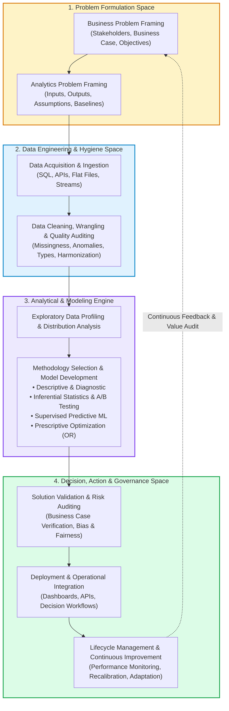
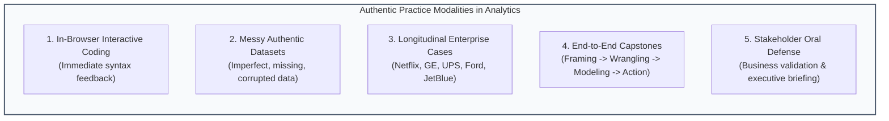
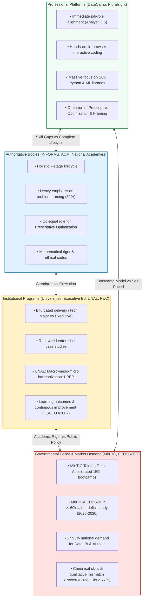
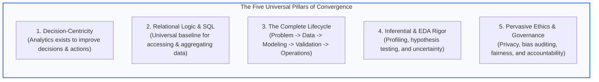
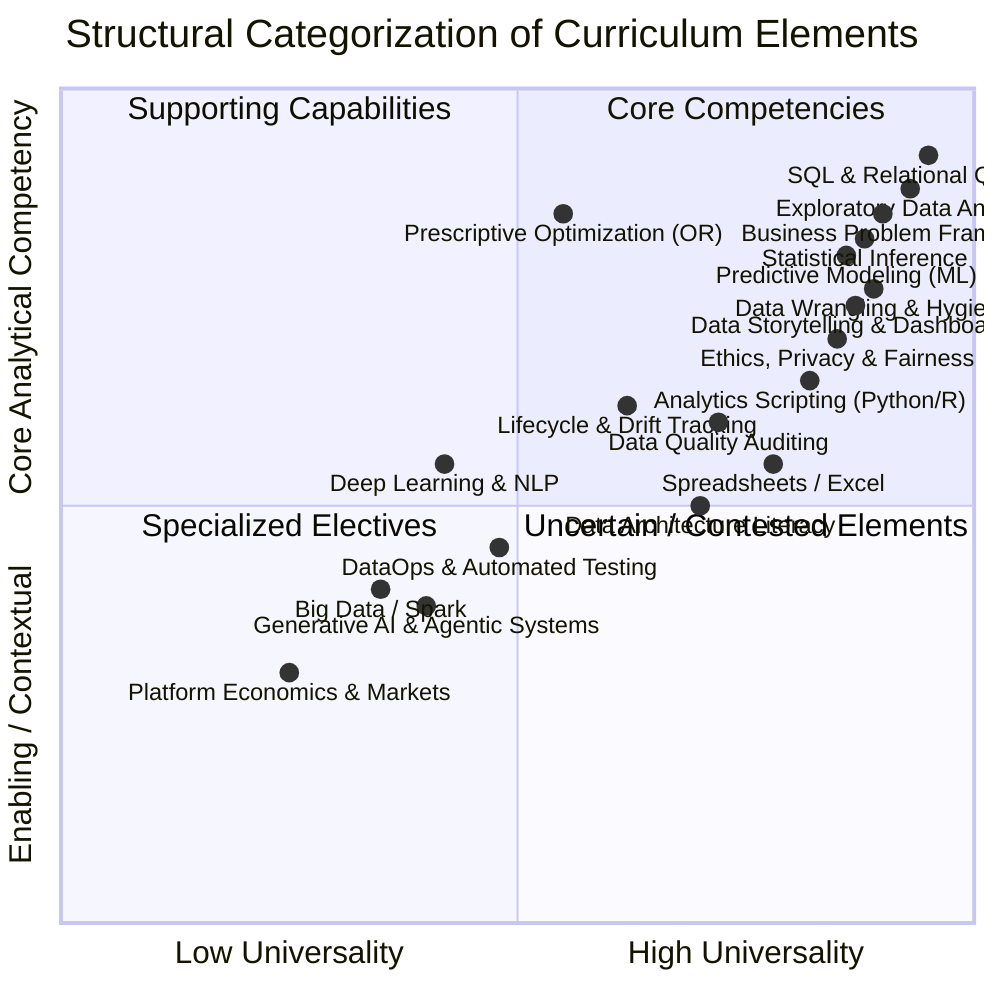
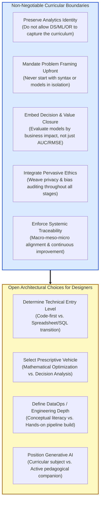

# Benchmark Synthesis

## 1. Scope and method

### 1.1 Scope and purpose of the synthesis

This document presents an independent, evidence-based review and structural synthesis of the curriculum benchmark corpus located in `design/benchmarks/` and related task-derived syntheses in `design/synthesis/`. The primary objective is to investigate and determine what the collective evidence—spanning authoritative academic and professional bodies, higher education institutions, governmental digital-skills policies, professional-learning providers, and literature-derived frameworks—reveals concerning the **educational identity, scope, core competencies, knowledge architecture, learning progression, and practical orientation of Analytics education**.

This task constitutes **benchmark synthesis**, not final curriculum design. Its function is to identify structural patterns, evaluate cross-corpus convergence, document genuine pedagogical disagreements, and establish the architectural boundaries, principles, and constraints that must govern subsequent curriculum design tasks.

### 1.2 Mandate and curricular identity

In strict compliance with `AGENTS.md`, the governing perspective throughout this synthesis is **Analytics**.

Analytics is treated as an autonomous, overarching educational discipline with its own organizing logic, rather than as an introductory survey, derivative track, or repackaging of adjacent fields. Machine Learning, Statistics, Operations Research and Optimization, Data Science, Data Engineering, Databases, Business Intelligence, and Artificial Intelligence are evaluated strictly as **contributing disciplines**. Concepts, methods, techniques, and tools from these contributing disciplines are selected, scoped, sequenced, and integrated exclusively according to their functional role within the Analytics decision lifecycle.

At no point in this synthesis is Analytics treated as synonymous with Data Science, reduced to algorithmic Machine Learning, confined to traditional Statistics, narrowed to Operations Research optimization, or conflated with Business Intelligence reporting.

### 1.3 Complete corpus analyzed

The synthesis analyzed all 42 primary and derived benchmark documents organized across the five evidence families present in the repository:

1. **Authoritative benchmarks (`design/benchmarks/authoritative/`) [5 documents]:**
   - `informs-analytics-framework-2024.pdf`: INFORMS Analytics Framework (IAF™), defining the 7 core domains of the professional analytics lifecycle.
   - `informs-cap-essentials-blueprint.pdf`: INFORMS Certified Analytics Professional Essentials (CAP-E) Exam Blueprint (2024), delineating entry-level knowledge, skills, and abilities (KSAs).
   - `informs-cap-pro-blueprint.pdf`: INFORMS Certified Analytics Professional (CAP-P) Professional Exam Blueprint (2024), delineating advanced practice KSAs.
   - `acm-computing-competencies-undergraduate-data-science-2021.pdf`: ACM/IEEE-CS/AAAI/SIAM curriculum report on Computing Competencies for Undergraduate Data Science Curricula (11 Knowledge Areas).
   - `national-academies-data-science-for-undergraduates-2018.pdf`: National Academies of Sciences, Engineering, and Medicine consensus study report on Data Science for Undergraduates, articulating the 10 components of "Data Acumen".

2. **Institutional benchmarks (`design/benchmarks/institutional/`) [21 documents]:**
   - `cambridge-business-analytics.pdf`: Cambridge Judge Business School Executive Education, *Business Analytics: Tomar Decisiones a Partir de los Datos* (9 modules).
   - `berkeley-data-c101-data-engineering.pdf`: UC Berkeley Data Science Undergraduate Studies, *DATA C101: Data Engineering*.
   - `berkeley-data-c102-data-inference-and-decisions.pdf`: UC Berkeley Data Science Undergraduate Studies, *DATA C102: Data, Inference, and Decisions*.
   - `mit-professional-certificate-data-science-and-analytics.pdf`: MIT xPRO, *Professional Certificate in Data Science and Analytics* (4 parts, 18 modules).
   - `mit-professional-certificate-data-engineering.pdf`: MIT xPRO, *Professional Certificate in Data Engineering* (24 modules).
   - `mit-data-science-and-machine-learning.pdf`: MIT IDSS, *Data Science and Machine Learning: Making Data-Driven Decisions* (12 weeks).
   - `mit-data-leadership.pdf`: MIT Professional Education, *Data Leadership: Transforming Operations, Management, and Mindset to Leverage Data, AI, and Cloud Computing* (8 modules).
   - `mit-cloud-and-devops.pdf`: MIT Professional Education, *Cloud & DevOps: Continuous Transformation* (8 modules).
   - `mit-digital-platforms.pdf`: MIT Professional Education, *Digital Platforms: Designing Two-Sided Markets from APIs to Feature Roadmaps* (8 modules).
   - `mit-machine-learning-modeling-and-simulation-principles.pdf`: MIT Professional Education, *Machine Learning, Modeling, and Simulation Principles*.
   - `mit-quantitative-methods-in-systems-engineering.pdf`: MIT Professional Education, *Quantitative Methods in Systems Engineering*.
   - `mit-rapid-prototyping-methodologies.pdf`: MIT xPRO, *Rapid Prototyping Methodologies for Commercial Application*.
   - `pwc-data-and-analytics-academy.pdf`: PricewaterhouseCoopers Nigeria, *Data & Analytics Academy Curriculum* (5 structured courses).
   - `usc-introduction-to-data-analytics.pdf`: USC Viterbi School of Engineering, *ITP 249: Introduction to Data Analytics*.
   - `warwick-foundations-of-data-analytics.pdf`: University of Warwick Department of Computer Science, *CS909: Foundations of Data Analytics*.
   - `stanford-ai-strategy-governance.pdf`: Stanford Online, *AI for Senior Executives: Strategy, Business Models, and Governance*.
   - `berkeley-ai-business-strategy-applications.pdf`: UC Berkeley Haas Executive Education, *Inteligencia Artificial: Estrategias y Aplicaciones de Negocio* (8 modules).
   - `ut-austin-agentic-ai-business-applications.pdf`: UT Austin McCombs / Great Learning, *Agentic AI for Business Applications*.
   - `mit-designing-and-building-ai-products-and-services.pdf`: MIT Professional Education, *Designing and Building AI Products and Services* (8 weeks).
   - `design/benchmarks/institutional/unal-lineamientos-armonizacion-curricular.pdf`: Universidad Nacional de Colombia (Dirección Académica, Sede Manizales, 2023), *Lineamientos para el proceso de armonización curricular de los programas curriculares de la Sede Manizales* (Circular No. 01 de 2023). Institutional guidelines establishing macro-, meso-, and microcurricular harmonization, the adoption of learning outcomes (Acuerdo 02/2020 CESU), and continuous academic improvement (Acuerdo 033/2007 CSU).
   - `design/benchmarks/institutional/unal-armonizacion-ejercicio-piloto.pdf`: Universidad Nacional de Colombia (DNPPre, DNPP, VRA, 2021), *Ejercicio Piloto UNAL para la Armonización Curricular*. Institutional co-creation study across 17 undergraduate programs establishing the three levels of the curricular field (determinación, estructuración, desarrollo), the systemic traceability chain (context/needs $\rightarrow$ educational intentionalities $\rightarrow$ graduate profile $\rightarrow$ learning outcomes $\rightarrow$ study plan $\rightarrow$ course calendar/didactics), and collegial evaluation.

3. **Governmental benchmarks (`design/benchmarks/governmental/`) [2 documents]:**
   - `design/benchmarks/governmental/mintic-talento-tech-2024-2026.pdf`: Ministerio de Tecnologías de la Información y las Comunicaciones (MinTIC), Republic of Colombia. Project specification for *Talento Tech* (2024–2026), establishing a 159-hour bootcamp model for accelerated training of 94,696 citizens in prioritized digital tracks, explicitly including *Análisis de Datos*.
   - `design/benchmarks/governmental/mintic-fedesoft-talento-digital-2025-2030.pdf`: Ministerio de Tecnologías de la Información y las Comunicaciones (MinTIC) & FEDESOFT / CENISOFT (2024/2025). *Estudio de la Brecha de Talento Digital en Colombia 2025–2030*. Quantitative and qualitative workforce diagnostic projecting a deficit of >160,000 digital professionals, documenting that Data Science, BI & AI represent 17.95% of national demand, and identifying critical enterprise skill requirements (data storytelling, risk analytics, applied Python, model calibration, source integration).

4. **Professional-learning syntheses (`design/synthesis/`) [2 documents]:**
   - `s01-datacamp.md`: Structured synthesis of first-party DataCamp career tracks, skill tracks, and certifications (Data Analyst, Business Analyst, Associate Data Scientist, Data Scientist).
   - `s02-pluralsight.md`: Structured synthesis of first-party Pluralsight learning paths, role foundations, and certifications (Data Analytics Foundations, Data Science Foundations, Python, Excel, Alteryx, Spark, DP-100 Azure, Generative AI).

5. **Literature-derived benchmarks (`design/benchmarks/literature-derived/`) [12 documents]:**
   - `conf-origen-y-evolucion-business-analytics.pdf`: Curated conference monograph examining the cognitive limits, decision traps, and technological evolution (RDBMS, ERP, CART, DWH, Big Data, Cloud) of Business Analytics.
   - `dataops-01-the-problem.pdf` to `dataops-10-organization.pdf`: 10-part reference monograph analyzing DataOps methodology, enterprise data strategy, lean/agile execution, data quality, leadership (CDO), and organizational structures.
   - `prodig8-strategies-executing-analytics-projects.pdf`: Peer-reviewed methodological study (Velasquez, Gallego, Cadavid, 2025) reconciling 18 analytics methodologies into the unified PRODIG8 model (Project, Data, Governance across 8 dimensions).

### 1.4 Synthesis methodology and qualitative weighting

The corpus was evaluated using qualitative cross-family triangulation:
- **Substantive analysis over titles:** Analysis was conducted on the substantive instructional content, syllabi, topic outlines, and competency definitions across all 42 documents rather than course titles, brochures, or marketing blurbs.
- **Cross-family triangulation:** A finding is classified as a robust, high-confidence feature of Analytics education only when supported across multiple independent evidence families (e.g., authoritative frameworks converging with university curricula, professional role tracks, and literature models).
- **Preservation of divergence:** Competing pedagogical philosophies (e.g., code-first vs. decision-first, mathematical optimization vs. behavioral nudges) are preserved and analyzed rather than artificially unified.
- **Corpus integrity:** In accordance with task guidelines, no external internet research was performed; all claims remain traceable to the local repository corpus.

### 1.5 Statement of independence

In strict compliance with the independence requirement of task S03, this synthesis was produced independently. No synthesis files produced by other LLM agents (specifically `s03-synthesis-chatgpt.md`, `s03-synthesis-claude.md`, or previous integration files) were read, inspected, or consulted.

---

## Actualización incremental — referentes institucionales y gubernamentales colombianos

Esta sección documenta la incorporación incremental de tres nuevos insumos documentales al corpus de referencia de la síntesis de Gemini, precisando su familia de evidencia, su función estructural y sus límites metodológicos de inferencia para salvaguardar estrictamente la identidad disciplinar de Analytics mandatada por `AGENTS.md`.

### Insumos incorporados y tipología de evidencia

1. **`design/benchmarks/institutional/unal-lineamientos-armonizacion-curricular.pdf`**
   - **Familia de evidencia:** Evidencia institucional (`design/benchmarks/institutional/`).
   - **Autoría y contexto normativo:** Universidad Nacional de Colombia, Dirección Académica de la Sede Manizales (Circular No. 01 de 2023, 12 de abril de 2023). Enmarcado en el Acuerdo 033 de 2007 del Consejo Superior Universitario (CSU — principios de Excelencia Académica y Gestión para el Mejoramiento Académico), el Acuerdo 02 de 2020 del Consejo Nacional de Educación Superior (CESU) y el Decreto 1330 de 2019 del Ministerio de Educación Nacional (MEN).
   - **Función evidencial:** Provee lineamientos institucionales normativos y metodológicos para orientar los procesos de autoevaluación, aseguramiento de la calidad y mejoramiento continuo. Establece las tres dimensiones estructurales de la armonización curricular:
     - *Macrocurricular:* Políticas, lineamientos institucionales y definición de la pertinencia académica y social del programa.
     - *Mesocurricular:* Revisión de la propuesta curricular, arquitectura formativa y despliegue del plan de estudios.
     - *Microcurricular:* Didácticas específicas, ambientes formativos y procesos de evaluación de los aprendizajes.
     Introduce operativamente la formulación y evaluación de resultados de aprendizaje centrados en logros demostrables del estudiante y la actualización de los Proyectos Educativos de Programa (PEP) articulados a planes de mejoramiento continuo.
   - **Límites de inferencia:** Es un instrumento institucional de gestión curricular y aseguramiento de la calidad en la educación superior pública colombiana. **No es un benchmark disciplinar internacional ni define por sí mismo los contenidos sustantivos, métodos, modelos o herramientas de Analytics**. Su función en esta síntesis es aportar los principios de coherencia interna, gobernanza colegiada, trazabilidad y mejoramiento continuo en la estructuración curricular.

2. **`design/benchmarks/institutional/unal-armonizacion-ejercicio-piloto.pdf`**
   - **Familia de evidencia:** Evidencia institucional (`design/benchmarks/institutional/`).
   - **Autoría y contexto normativo:** Universidad Nacional de Colombia (Vicerrectoría Académica, Dirección Nacional de Programas Curriculares de Pregrado - DNPPre, Dirección Nacional de Innovación Académica - DNIA, 2021). Sistematización de la experiencia piloto de co-creación curricular desarrollada con 17 programas de pregrado de las sedes Bogotá, Palmira, Manizales y La Paz.
   - **Función evidencial:** Aporta un marco conceptual y metodológico riguroso basado en la noción de *campo curricular* como entidad sistémica, relacional y dinámica. Estructura el quehacer formativo en tres niveles de campo:
     - *Nivel de Determinación (Macro):* Acogida crítica de la propuesta política y educativa institucional (proyecto de nación, pertinencia y relevancia social frente al entorno).
     - *Nivel de Estructuración (Meso):* Reconocimiento de dinámicas epistemológicas y sociales que superan las fronteras disciplinares rígidas, definiendo la arquitectura del plan de estudios.
     - *Nivel de Desarrollo (Micro):* Operacionalización en ambientes de aprendizaje, estrategias pedagógicas, recursos y modos de evaluación formativa.
     Establece y valida la **cadena de trazabilidad curricular integral**:
     $$\text{Contexto / Necesidades} \longrightarrow \text{Intencionalidades Formativas (PEP)} \longrightarrow \text{Perfil de Egreso} \longrightarrow \text{Resultados de Aprendizaje} \longrightarrow \text{Plan de Estudios} \longrightarrow \text{Programa-Calendario / Didácticas}$$
     Demuestra que la armonización curricular es un proceso colegiado, dialógico, deliberativo y participativo (que convoca a docentes, estudiantes, egresados y actores del entorno) orientado al mejoramiento continuo y sistemático (Acuerdo 033 de 2007 CSU).
   - **Límites de inferencia:** Documenta un proceso de evaluación y diseño curricular universitario en Colombia. **No constituye un estándar de contenido para la disciplina de Analytics**, ni resuelve debates metodológicos específicos (como la formulación matemática de optimización vs. heurísticas). Proporciona la lógica estructural de alineación y trazabilidad entre las intencionalidades formativas y la ejecución microcurricular, sin alterar las fronteras del dominio de Analytics.

3. **`design/benchmarks/governmental/mintic-fedesoft-talento-digital-2025-2030.pdf`**
   - **Familia de evidencia:** Evidencia gubernamental y sectorial colombiana (`design/benchmarks/governmental/`).
   - **Autoría y contexto:** Ministerio de Tecnologías de la Información y las Comunicaciones (MinTIC) & Federación Colombiana de la Industria de Software y Tecnologías de la Información Relacionadas (FEDESOFT / CENISOFT), 2024–2025. Estudio nacional sobre empleabilidad, pertinencia y demanda de talento en la industria tecnológica.
   - **Función evidencial:** Proporciona evidencia empírica rigurosa sobre la pertinencia externa y las señales de demanda laboral en Colombia hacia el periodo 2025–2030:
     - *Déficit cuantitativo masivo:* Proyecta una brecha de talento digital superior a **160.000 profesionales** para el periodo 2025–2030 en el país.
     - *Priorización de la analítica:* Sitúa a **"Ciencia de datos, BI, AI" como el segundo macro-rol más demandado a nivel nacional con un 17,95% de la demanda total de talento TI**, superado únicamente por Desarrollo de Software (30,19%).
     - *Brecha cualitativa estructural:* Documenta una desconexión crítica entre la oferta universitaria tradicional y las exigencias empresariales (desactualización de planes de estudio, ausencia de experiencia práctica con problemas reales, brecha del 76,1% en herramientas de visualización como Power BI, 77,1% en tecnologías cloud y 99,5% en estándares normativos y seguridad).
     - *Catálogo canónico de habilidades analíticas demandadas:* Identifica con precisión las competencias requeridas por los empleadores para roles analíticos:
       - *Comunicación analítica:* Presentación de informes gerenciales y *Storytelling* con datos.
       - *Contexto de dominio:* Dominio de industria y analítica de riesgos.
       - *Data & features:* Integración de fuentes heterogéneas, minería de datos, Python aplicado, SQL avanzado y Excel avanzado.
       - *Modelado y analítica:* Analítica avanzada, *backtesting* de modelos, calibración de modelos, monitoreo continuo de modelos en producción, series de tiempo y segmentación.
       - *Riesgo de modelos:* Manual de riesgo, gobernanza y validación estadística.
       - *Competencias transversales:* Pensamiento crítico, rigurosidad técnica, visión de negocio, análisis de negocio, trabajo colaborativo inter-áreas y orientación a resultados.
   - **Límites de inferencia:** Representa un diagnóstico sectorial y de política pública enfocado en el mercado laboral colombiano. **No es un estándar curricular internacional ni una prescripción para degradar el currículo de Analytics convirtiéndolo en un curso de programación general, Big Data o DevOps**. Sus hallazgos deben alimentar la pertinencia externa y la contextualización de los resultados de aprendizaje, garantizando que el egresado sea capaz de responder a problemas productivos reales sin subordinar la disciplina de Analytics a las modas pasajeras de la industria.

---

## 2. Analytics as an educational domain

### 2.1 The defining identity: The science and practice of decision-driven value creation

Across all five evidence families, Analytics emerges with an unambiguous curricular identity: it is **the discipline dedicated to converting data into insights that directly inform decisions, guide operational interventions, and generate measurable organizational value**.

In authoritative benchmarks, the INFORMS Analytics Framework (`informs-analytics-framework-2024.pdf`) establishes that Analytics is an integrated, end-to-end lifecycle. INFORMS assigns 32% of its total credentialing examination weight strictly to problem framing:
- **Domain I: Business Problem (Question) Framing (16% in CAP-E, 17% in CAP-P):** Understanding the business context, identifying stakeholders, determining whether a problem is amenable to analytics, establishing a business case, and securing sponsor alignment.
- **Domain II: Analytics Problem Framing (16% in CAP-E, 15% in CAP-P):** Reformulating the business question into a structured analytical problem, defining input/output drivers, stating simplifying assumptions, establishing primary success metrics, and identifying baseline performance.

In literature-derived evidence, this decision-centric purpose is formalized in `dataops-03-methodologies.pdf` through the analytical value chain:
$$\text{Problema} \longrightarrow \text{Datos} \longrightarrow \text{Modelo} \longrightarrow \text{Soluci\acute{o}n} \longrightarrow \text{Decisi\acute{o}n} \longrightarrow \text{Acci\acute{o}n} \longrightarrow \text{Valor}$$
`dataops-03-methodologies.pdf` establishes a central educational principle: *"Un buen modelo no garantiza un buen proyecto de analítica. Puede ser técnicamente correcto y, aun así, no resolver el problema, no ser utilizado o no generar valor."* (A good model does not guarantee a good analytics project. It can be technically correct and yet fail to solve the problem, fail to be adopted, or fail to generate value.)

This is reinforced by the peer-reviewed unified framework PRODIG8 (`prodig8-strategies-executing-analytics-projects.pdf`), which observes that up to 87% of data science projects never reach production and over 80% of organizations lack a formal execution methodology. PRODIG8 demonstrates that analytics is an execution–control–adaptation architecture combining Project Scope Definition, Data Understanding, Data Preparation, Project Design, Model Evaluation, and Operation & Maintenance under the transversal control of Governance & Ethics and the adaptive feedback of Continuous Improvement.

Institutional and governmental benchmarks reinforce this orientation:
- Cambridge Judge Business School (`cambridge-business-analytics.pdf`) anchors its entire curriculum in *"tomar decisiones a partir de los datos"*, deliberately dedicating Module 1 to cognitive traps and decision biases (*Sesgos en Decisiones*) before introducing any analytical models.
- USC (`usc-introduction-to-data-analytics.pdf`) defines the objective of Analytics as leveraging data to make critical business decisions confidently, structuring learning around posing questions, collecting relevant data, analyzing patterns, and communicating insights.
- MinTIC's *Talento Tech* (`design/benchmarks/governmental/mintic-talento-tech-2024-2026.pdf`) establishes *Análisis de Datos* as an applied track designed specifically to meet labor market demand, using a "Learning by Doing" bootcamp methodology to solve real-world problems.
- MinTIC & FEDESOFT (`design/benchmarks/governmental/mintic-fedesoft-talento-digital-2025-2030.pdf`) demonstrate that national labor demand for data profiles (representing 17.95% of total digital talent demand in Colombia) is fundamentally defined by the ability to generate decision impact: companies prioritize skills in data storytelling, executive report presentation, risk analytics, and model calibration over pure abstract coding.
- Universidad Nacional de Colombia (`design/benchmarks/institutional/unal-lineamientos-armonizacion-curricular.pdf` and `design/benchmarks/institutional/unal-armonizacion-ejercicio-piloto.pdf`) establishes that educational relevance (*pertinencia académica y social*) requires curricular structures to originate directly from contextual problems and societal needs, translating them into verifiable learning outcomes (*resultados de aprendizaje*) that prepare graduates to make meaningful interventions in real organizational settings.

### 2.2 Characteristic activities of the Analytics lifecycle

Synthesizing across INFORMS, university programs (MIT, Cambridge, Berkeley, Warwick), literature methodologies (CRISP-DM, TDSP, PRODIG8, DataOps), and professional tracks (DataCamp, Pluralsight), the characteristic activities defining Analytics education form a closed, iterative lifecycle:



### 2.3 Technical execution vs. contextual judgment

The benchmark corpus demonstrates that technical proficiency without contextual judgment is insufficient:
- **The failure of isolated technical models:** The historical monograph `conf-origen-y-evolucion-business-analytics.pdf`, the DataOps series (`dataops-01-the-problem.pdf`), and PRODIG8 (`prodig8-strategies-executing-analytics-projects.pdf`) document that the majority of analytics projects fail not due to mathematical or algorithmic errors, but because data teams operate in organizational silos, solve unaligned problems, or fail to account for operational constraints.
- **Contextual judgment dictates technique:** In Analytics, the practitioner must judge whether an operational problem requires a complex ensemble model, a simple interpretable decision tree, an optimization solver, or an interactive dashboard. As highlighted in MIT's Data Leadership program (`mit-data-leadership.pdf`), leaders and analysts must evaluate the modern data stack, algorithmic fairness, and data architectures against strategic corporate objectives.

---

## 3. Analytics and contributing disciplines

In an Analytics curriculum, contributing disciplines provide foundational concepts, mathematical methods, and software tools. However, each discipline must be scoped by the **specific function** it serves within the Analytics decision lifecycle.

```mermaid
graph TD
    Analytics(["ANALYTICS CURRICULUM<br/>(Organizing Discipline: Decision-Driven Value Creation)"])

    subgraph FoundationAccess ["Data Access & Epistemic Foundations"]
        DB["Databases (SQL)<br/>• Relational logic & schemas<br/>• Filtering, joins & aggregations"]
        STAT["Statistics<br/>• Probability distributions<br/>• Inference & hypothesis testing<br/>• A/B testing & causal bounds"]
        DE["Data Engineering<br/>• Ingestion pipelines & ELT<br/>• Scalability, hygiene & DataOps"]
    end

    subgraph AnalyticalEngine ["Methodological Modeling Engine"]
        DS["Data Science<br/>• Data acumen & feature engineering<br/>• Exploratory computational thinking"]
        ML["Machine Learning<br/>• Pattern recognition & classification<br/>• Predictive scoring & trees/ensembles"]
        OR["Operations Research<br/>• Constrained mathematical optimization<br/>• Decision variables & tradeoff analysis"]
    end

    subgraph DecisionDelivery ["Decision Delivery & Strategic Action"]
        BI["Business Intelligence<br/>• Descriptive KPIs & metrics<br/>• Visual dashboards & storytelling"]
        AI["Artificial Intelligence<br/>• Unstructured data parsing (NLP/Vision)<br/>• Generative augmentation & agents<br/>• AI strategy, governance & ethics"]
    end

    DB -->|Data Access Layer| Analytics
    STAT -->|Inferential Rigor| Analytics
    DE -->|Pipeline Infrastructure| Analytics
    DS -->|Methodological Toolkit| Analytics
    ML -->|Predictive Engine| Analytics
    OR -->|Prescriptive Guidance| Analytics
    BI -->|Descriptive & Visual Delivery| Analytics
    AI -->|Cognitive Augmentation & Governance| Analytics

    style Analytics fill:#1e3a8a,stroke:#1d4ed8,stroke-width:3px,color:#ffffff
    style FoundationAccess fill:#f8fafc,stroke:#94a3b8,stroke-width:1px
    style AnalyticalEngine fill:#f0fdf4,stroke:#86efac,stroke-width:1px
    style DecisionDelivery fill:#fefce8,stroke:#fde047,stroke-width:1px
```



### 3.1 Data Science
- **Disciplinary perspective:** An interdisciplinary field combining computing, mathematics, and statistics to discover novel phenomena and build data products (ACM 2021; National Academies 2018).
- **Curricular function in Analytics:** Data Science contributes the holistic concept of **data acumen** (National Academies 2018)—the practical ability to explore messy datasets, engineer features, and combine computational thinking with empirical inquiry. While Data Science curricula in computer science departments emphasize algorithm design and distributed computing systems (ACM 2021), in Analytics, Data Science methods serve as the practical toolkit for hypothesis exploration and predictive modeling tied to substantive organizational questions.

### 3.2 Machine Learning
- **Disciplinary perspective:** The subfield of computer science dedicated to algorithms that learn representations and predictive rules directly from empirical data (ACM ML Knowledge Area; MIT Machine Learning Principles).
- **Curricular function in Analytics:** Machine Learning provides the **predictive engine**. Algorithms such as linear/logistic regression, decision trees (CART), random forests, gradient boosting, support vector machines, and basic neural networks are studied not for theoretical asymptotic proofs, but for their ability to predict unknown variables (customer churn, asset failure, credit risk, demand) that feed into decision models (INFORMS Domain V; Cambridge M5–6; MIT PC DSA Parts 3 & 4; Warwick CS909; DataCamp). Analytics curricular logic prioritizes model validation, cross-validation, hyperparameter tuning, interpretability, and the prevention of overfitting.

### 3.3 Statistics
- **Disciplinary perspective:** The mathematical science of uncertainty, data collection, estimation, and probabilistic inference.
- **Curricular function in Analytics:** Statistics provides the **inferential guardrails and epistemic foundation**. It provides the mathematical principles of probability distributions, sampling variability, hypothesis testing ($t$-tests, ANOVA, chi-square), confidence intervals, and experimental design (National Academies 2018; Berkeley DATA C102; INFORMS Domain IV; Pluralsight). In Analytics, statistics ensures that observed patterns are not random noise, provides the framework for controlled experimentation (A/B testing in Cambridge M4), and allows analysts to rigorously quantify risk and confidence in recommendations.

### 3.4 Operations Research and Optimization
- **Disciplinary perspective:** The mathematical discipline that utilizes linear programming, integer programming, non-linear optimization, stochastic processes, and simulation to solve complex operational decision problems.
- **Curricular function in Analytics:** Operations Research is the mathematical foundation of **prescriptive analytics**. While predictive models answer "what will happen?", Operations Research answers the definitive question: *"What action should be taken?"* under constraints of capital, capacity, workforce, and regulatory policy (INFORMS Domains IV & V; MIT PC DSA Part 2; Cambridge M7; MIT Quantitative Methods in Systems Engineering). OR equips learners with the mathematical structures (decision variables, objective functions, constraint boundaries, shadow prices) needed to move from prediction to optimal policy.

### 3.5 Data Engineering
- **Disciplinary perspective:** The software engineering discipline focused on designing, deploying, and maintaining scalable distributed infrastructure, storage systems, and data pipelines (Berkeley DATA C101; MIT PC Data Engineering; MIT Cloud & DevOps).
- **Curricular function in Analytics:** In an Analytics curriculum, Data Engineering serves an **enabling infrastructure function**. Learners do not need to build distributed database engines or write custom network protocols; rather, they require functional pipeline literacy: querying enterprise data warehouses and lakes, writing automated transformation scripts (ELT), understanding schema normalization, managing data quality rules, and collaborating with engineering teams (INFORMS Domain III; MIT Data Leadership; DataOps-08).

### 3.6 Databases
- **Disciplinary perspective:** The study of relational models, database management systems (RDBMS), NoSQL architectures, indexing, and declarative query languages.
- **Curricular function in Analytics:** Databases and SQL represent the **foundational data access layer**. SQL is the single most recurring technical tool across the entire 42-document corpus (USC ITP 249; Warwick CS909; DataCamp; Pluralsight; Conf-Origen; MIT Data Leadership). In Colombian labor market evidence, MinTIC & FEDESOFT (`design/benchmarks/governmental/mintic-fedesoft-talento-digital-2025-2030.pdf`) classify "SQL avanzado" as an indispensable canonical hard skill within the "Data & features" domain. Database concepts enable analysts to independently inspect schemas, extract data from transactional systems, execute multi-table joins, compute summary metrics, and ensure transactional data consistency.

### 3.7 Business Intelligence
- **Disciplinary perspective:** Enterprise technologies, processes, and architectures that support descriptive reporting, multidimensional OLAP cubes, and executive dashboards.
- **Curricular function in Analytics:** Business Intelligence provides the **descriptive/diagnostic baseline** and the **primary visual reporting interface** (PwC Data & Analytics Academy; DataCamp BA Track; Pluralsight BI Tools; Conf-Origen). BI concepts teach learners how to define valid organizational KPIs, structure operational dashboards, and present data-driven narratives that executives and operational managers can immediately interpret.

### 3.8 Artificial Intelligence
- **Disciplinary perspective:** The broad computing discipline concerned with creating intelligent agents, natural language processing, computer vision, deep generative models, and autonomous decision systems.
- **Curricular function in Analytics:** AI contributes in two distinct ways:
  1. *Unstructured data extraction:* Using natural language processing and computer vision to extract structured features from text, audio, and images for inclusion in downstream analytical models (Cambridge M6; Berkeley AI; Stanford AI Strategy).
  2. *Workflow augmentation and agentic systems:* Leveraging generative AI and autonomous agents for data wrangling, automated code generation, and synthetic scenario generation, accompanied by critical human oversight regarding hallucination, bias, data privacy, and governance (Pluralsight Generative AI; UT Austin Agentic AI; MIT Designing AI Products; DataOps-06).

---

## 4. Recurring capabilities

A cross-source synthesis across all five evidence families reveals nine recurring learner capabilities. These groupings emerged organically from the operational demands of the complete analytics lifecycle:

| Capability Group | Core Definition & Operational Scope | Supporting Evidence & Benchmark Families | Qualitative Evidence Weight | Key Variations & Nuances across Disciplines |
|---|---|---|---|---|
| **1. Business & Analytics Problem Framing** | Decomposing ambiguous business symptoms into structured analytical questions; identifying stakeholders; defining input/output drivers; establishing baseline performance and success metrics. | **Authoritative:** INFORMS Domains I & II (32% of CAP exam).<br/>**Institutional:** Cambridge M1; Stanford; Warwick; MIT Data Leadership; UNAL Lineamientos & Ejercicio Piloto (Context analysis and macrocurricular needs definition).<br/>**Governmental:** MinTIC/FEDESOFT (*Negocio y producto: Análisis y visión de negocio*).<br/>**Professional:** Pluralsight Data Analytics Foundations.<br/>**Literature:** PRODIG8 Dimension 1 (Scope); DataOps-02 & 03. | **Universal / High** | Professional coding platforms compress framing into simple problem briefs; authoritative, literature, institutional, and executive benchmarks treat framing as an extensive, multi-step competency. |
| **2. Data Ingestion, Wrangling & Quality Auditing** | Connecting to relational databases, APIs, and file repositories; cleaning, joining, and harmonizing datasets; identifying and resolving missingness, schema errors, and outliers. | **Authoritative:** INFORMS Domain III (19% weight); National Academies; ACM DG.<br/>**Institutional:** Berkeley C101; USC ITP 249; Warwick CS909; PwC Day 2.<br/>**Governmental:** MinTIC/FEDESOFT (*Data & features: Integración de fuentes, Minería de datos, Python aplicado, SQL avanzado*).<br/>**Professional:** DataCamp Python/R/SQL; Pluralsight.<br/>**Literature:** PRODIG8 D2 & D3 (Understanding & Preparation); Conf-Origen; DataOps-09. | **Universal / High** | Computer science programs focus on scalable streaming and distributed storage; analytics programs prioritize data hygiene, validation rules, and tabular manipulation. |
| **3. Exploratory Data Profiling & Distribution Analysis** | Calculating descriptive statistics; profiling univariate distributions; examining bivariate correlations; visualizing interactions; detecting anomalies. | **Authoritative:** National Academies (Data Acumen); ACM AP; INFORMS Task 3.6.<br/>**Institutional:** Warwick CS909; MIT PC DSA M1; PwC Day 2.<br/>**Professional:** DataCamp EDA; Pluralsight EDA.<br/>**Literature:** PRODIG8 D2; DataOps-03 (KDD/CRISP-DM exploration). | **Universal / High** | Unanimously recognized as an obligatory diagnostic gateway before any modeling or inferential claims can be made. |
| **4. Statistical Inference & Experimental Design** | Formulating testable hypotheses; calculating confidence intervals; conducting significance tests; designing and analyzing A/B experiments; separating correlation from causation. | **Authoritative:** National Academies; Berkeley C102; ACM; INFORMS Domain IV.<br/>**Institutional:** Berkeley C102; Cambridge M4; MIT PC DSA M2–3.<br/>**Professional:** DataCamp Statistical Experimentation; Pluralsight Stats.<br/>**Literature:** PRODIG8 D4; DataOps-03; Conf-Origen. | **Universal / High** | Academic benchmarks demand formal mathematical probability and theoretical distributions; professional platforms focus on practical A/B test interpretation. |
| **5. Predictive Modeling & Pattern Recognition** | Selecting, fitting, evaluating, and tuning supervised machine learning models (linear/logistic regression, CART, random forests, boosting, SVM); avoiding overfitting via cross-validation. | **Authoritative:** INFORMS Domain V; ACM ML; National Academies.<br/>**Institutional:** Cambridge M5–6; MIT PC DSA M5–7, 14–15; Warwick; PwC Day 3.<br/>**Governmental:** MinTIC Talento Tech; MinTIC/FEDESOFT (*Modelado y analítica: Analítica avanzada, Series de tiempo, Segmentación*).<br/>**Professional:** DataCamp Associate DS; Pluralsight ML.<br/>**Literature:** PRODIG8 D4 & D5; Conf-Origen (CART monograph); DataOps-08. | **Universal / High** | Pure computer science curricula focus on deep neural architectures; analytics curricula emphasize model interpretability, validation, and operational fit. |
| **6. Prescriptive Modeling & Optimization** | Translating decisions into mathematical formulations using decision variables, objective functions, and constraints; solving linear/integer programs; conducting tradeoff and sensitivity analysis. | **Authoritative:** INFORMS Domains IV & V (Methodology & Model Development).<br/>**Institutional:** MIT PC DSA Part 2 (5 modules on Optimization); Cambridge M7; MIT Quantitative Methods.<br/>**Professional:** Absent in DataCamp/Pluralsight.<br/>**Literature:** PRODIG8 D4; DataOps-03. | **Partial / Bimodal** | Central to authoritative bodies and top-tier university analytics programs; completely omitted by commercial developer platforms. |
| **7. Solution Validation, Financial Impact & Bias Auditing** | Evaluating models against operational baselines; verifying net financial ROI; auditing algorithms for demographic bias, data leakage, and unintended side effects. | **Authoritative:** INFORMS Domains VI & VII; National Academies (Ethics); ACM DPSIA.<br/>**Institutional:** Berkeley C102; Cambridge M1/M9; Stanford; MIT PC DSA M16.<br/>**Governmental:** MinTIC/FEDESOFT (*Riesgo de modelos: Manual de riesgo, Validación estadística; Analítica de riesgos*).<br/>**Professional:** DataCamp Data Scientist Certification practicals.<br/>**Literature:** PRODIG8 D5 & D7 (Governance & Ethics); DataOps-01 & 09. | **High / Growing** | Traditional curricula evaluated models solely on error metrics ($R^2$, RMSE); modern benchmarks mandate bias auditing, fairness metrics, risk governance, and business validation. |
| **8. Data Storytelling & Executive Communication** | Designing communicative visualizations and interactive dashboards; translating complex technical outputs into executive summaries; presenting actionable recommendations. | **Authoritative:** INFORMS Task 5.6/6.2; National Academies; ACM PR.<br/>**Institutional:** USC ITP 249; PwC Day 1–3; Cambridge; MIT Data Leadership.<br/>**Governmental:** MinTIC Talento Tech (Transversal soft skills); MinTIC/FEDESOFT (*Comunicación analítica: Storytelling con datos, Presentación de informes; Comunicación efectiva*).<br/>**Professional:** DataCamp Communication; Pluralsight BI.<br/>**Literature:** PRODIG8 D4; DataOps-02 & 03. | **Universal / High** | Professional certifications test recorded presentations and dashboard creation; executive and governmental benchmarks emphasize strategic briefing and storytelling to bridge the corporate gap. |
| **9. Operational Governance, DataOps & Lifecycle Management** | Operationalizing models into production; managing repeatable pipelines; tracking performance decay and data drift; documenting data lineage and version control. | **Authoritative:** INFORMS Domains VI & VII (Deployment & Lifecycle Management).<br/>**Institutional:** Berkeley C101; MIT Data Leadership; MIT Cloud & DevOps; UNAL Lineamientos (Continuous improvement & self-evaluation, Acuerdo 033/2007 CSU).<br/>**Governmental:** MinTIC/FEDESOFT (*Monitoreo de modelos, Calibración de modelos, Backtesting de modelos*).<br/>**Professional:** Pluralsight DP-100; DataCamp Docker/Databricks.<br/>**Literature:** PRODIG8 D6 & D8 (Continuous Improvement); Complete DataOps series (01–10). | **Moderate to High** | Comprehensively developed in INFORMS and literature benchmarks (PRODIG8, DataOps); reinforced by institutional continuous improvement models; treated as an advanced elective in traditional university degree programs. |

---

## 5. Knowledge architecture

Synthesizing across the corpus, Analytics education requires a structured, multi-tier knowledge architecture that connects foundational mathematical concepts to executive decision governance:

```
┌─────────────────────────────────────────────────────────────────────────────┐
│ TIER 5: STRATEGIC, CONTEXTUAL & ETHICAL GOVERNANCE                          │
│ • Business Problem Formulation & Scope  • Decision Traps & Cognitive Biases │
│ • Algorithmic Fairness, Privacy & Law   • Change Management & Value Realiz. │
└──────────────────────────────────────┬──────────────────────────────────────┘
                                       ▼
┌─────────────────────────────────────────────────────────────────────────────┐
│ TIER 4: CORE ANALYTICAL METHODOLOGIES                                       │
│ • Descriptive Summaries & KPIs          • Statistical Inference & Testing   │
│ • Supervised Predictive ML (Trees/Reg)  • Prescriptive Optimization & OR    │
└──────────────────────────────────────┬──────────────────────────────────────┘
                                       ▼
┌─────────────────────────────────────────────────────────────────────────────┐
│ TIER 3: OPERATIONALIZATION & LIFECYCLE MANAGEMENT                           │
│ • DataOps, CI/CD & Automated Testing    • Deployment & Production Flows     │
│ • Model Monitoring, Drift & Recalib.    • Data Lineage & Metadata Gov.      │
└──────────────────────────────────────┬──────────────────────────────────────┘
                                       ▼
┌─────────────────────────────────────────────────────────────────────────────┐
│ TIER 2: ENABLING DATA & COMPUTATIONAL TOOLS                                 │
│ • Relational Databases & SQL (Queries)  • Analytics Scripting (Python / R)   │
│ • Tabular Manipulation (pandas/dplyr)   • BI Dashboards (Power BI/Tableau)  │
└──────────────────────────────────────┬──────────────────────────────────────┘
                                       ▼
┌─────────────────────────────────────────────────────────────────────────────┐
│ TIER 1: MATHEMATICAL & COMPUTATIONAL FOUNDATIONS                            │
│ • Probability Theory & Distributions    • Linear Algebra & Matrix Logic     │
│ • Calculus & Optimization Principles    • Data Structures & Algorithms      │
└─────────────────────────────────────────────────────────────────────────────┘
```

### 5.1 Tier 1: Mathematical and computational foundations
- **Probability Theory and Distributions:** Discrete and continuous distributions (Binomial, Poisson, Normal, Exponential), conditional probability, Bayes' theorem, expectations, and variance (National Academies; Berkeley C102; MIT PC DSA M2; Warwick CS909).
- **Linear Algebra Fundamentals:** Matrix operations, dot products, vector spaces, eigenvalues, and dimensionality reduction techniques (PCA, SVD) (ACM PDA; Warwick CS909; Berkeley C102).
- **Calculus and Numerical Concepts:** Rates of change, gradients, loss function surfaces, and basic numerical methods (ODEs, Euler methods in `mit-machine-learning-modeling-and-simulation-principles.pdf`; ACM PDA).
- **Core Computational Logic:** Variables, loops, conditional branching, recursion, and core data structures (arrays, hash maps, trees) (ACM CCF/PDA; DataCamp; Pluralsight).

### 5.2 Tier 2: Enabling data and computational tools
- **Relational Databases and SQL:** DDL, DML, relational algebra, primary/foreign keys, inner/outer joins, aggregations, subqueries, and window functions (USC; Warwick; DataCamp SQL; Pluralsight; Conf-Origen; MIT Data Leadership).
- **Analytics Scripting Languages:** Python (pandas, NumPy) or R (tidyverse, dplyr), environment configuration (Jupyter, RStudio), and functional data manipulation (DataCamp; Pluralsight; Warwick).
- **Business Intelligence Suites:** Tabular data models, DAX/calculated measures, visual layout, and interactive dashboard authoring in Power BI, Tableau, or Excel (PwC; DataCamp; Pluralsight; USC; MinTIC).

### 5.3 Tier 3: Operationalization and lifecycle management
- **Data Quality Auditing and Hygiene:** Techniques for profiling datasets, detecting null patterns, resolving schema mismatches, and auditing data integrity (INFORMS Domain III; PRODIG8 D2/D3; DataOps-09; Berkeley C101).
- **DataOps and Workflow Automation:** Version control (Git), automated testing harnesses, modular pipeline architecture, and containerization awareness (Docker) (PRODIG8 D6; DataOps-04 to 06; Berkeley C101; MIT Cloud & DevOps).
- **Deployment, Monitoring, and Model Recalibration:** Transitioning models into business workflows, establishing monitoring metrics, tracking concept and data drift, model backtesting, and managing scheduled model recalibrations (INFORMS Domains VI & VII; PRODIG8 D6 & D8; DataOps-03; MinTIC/FEDESOFT canonical skills: *Monitoreo de modelos, Calibración de modelos, Backtesting de modelos*).

### 5.4 Tier 4: Core analytical methodologies
- **Descriptive and Diagnostic Analytics:** Measures of central tendency and dispersion, percentiles, anomaly detection, cohort decomposition, and root-cause analysis (INFORMS Domain IV; Cambridge M2; DataCamp).
- **Inferential Statistics and Experimentation:** Point estimation, confidence intervals, hypothesis testing ($t$-test, ANOVA, chi-square), effect sizes, and A/B test design and analysis (Cambridge M4; Berkeley C102; Pluralsight).
- **Predictive Analytics (Machine Learning):** Linear regression, logistic regression, classification and regression trees (CART), random forests, gradient-boosted trees, clustering ($k$-means), cross-validation, and ROC/AUC analysis (INFORMS Domain V; MIT PC DSA; Cambridge M5–6; Warwick; PRODIG8 D4).
- **Prescriptive Analytics (Optimization):** Linear programming, integer programming, sensitivity analysis, shadow prices, decision trees under risk, and scenario simulation (INFORMS Domains IV & V; MIT PC DSA Part 2; Cambridge M7; MIT Quantitative Methods).

### 5.5 Tier 5: Strategic, contextual, and ethical governance
- **Business Problem Formulation and Alignment:** Translating business problems into structured analytics statements, defining input/output relationships, identifying constraints, and aligning executive sponsors (INFORMS Domains I & II; PRODIG8 D1; DataOps-02).
- **Decision Science and Behavioral Economics:** Recognizing cognitive decision traps, heuristics, confirmation bias, framing effects, and choice architecture (Cambridge M1 & M8; Conf-Origen).
- **Ethics, Privacy, and Algorithmic Fairness:** Data governance frameworks, regulatory compliance (GDPR, privacy laws), differential privacy, evaluating algorithmic bias, and ensuring explainability (National Academies Rec. 2.4; ACM DPSIA/PR; PRODIG8 D7; Stanford; Berkeley C102; MinTIC/FEDESOFT model risk management).
- **Institutional Curricular Architecture & Systemic Traceability (UNAL Benchmark):**
  Drawing from the Universidad Nacional de Colombia's institutional harmonization frameworks (`design/benchmarks/institutional/unal-lineamientos-armonizacion-curricular.pdf` and `design/benchmarks/institutional/unal-armonizacion-ejercicio-piloto.pdf`), curriculum design requires structured governance across three interconnected levels:
  - *Macrocurricular level:* Institutional policies, academic and social pertinence, and alignment with national quality regulations (Decreto 1330/2019 MEN, Acuerdo 02/2020 CESU).
  - *Mesocurricular level:* Curricular architecture, integration of contributing disciplines into the Analytics core without silo fragmentation, and deployment of the study plan (*plan de estudios*).
  - *Microcurricular level:* Specific didactics, learning environments, syllabus/calendar design (*programa-calendario*), and learning assessment processes (*evaluación de los aprendizajes*).
  These levels are operationalized through an unbroken, verifiable **traceability chain**:
  $$\text{Contexto / Necesidades} \longrightarrow \text{Intencionalidades Formativas (PEP)} \longrightarrow \text{Perfil de Egreso} \longrightarrow \text{Resultados de Aprendizaje} \longrightarrow \text{Plan de Estudios} \longrightarrow \text{Programa-Calendario / Did\acute{a}cticas}$$
  This governance framework mandates that harmonization be a participatory, collegial, and continuous improvement process (Acuerdo 033 de 2007 CSU), periodically re-evaluating whether learning outcomes are being achieved and how teaching strategies must adapt.
- **External Pertinence & Labor Market Calibration (MinTIC/FEDESOFT Benchmark):**
  Incorporating national diagnostic evidence (`design/benchmarks/governmental/mintic-fedesoft-talento-digital-2025-2030.pdf`), governance requires closing the acute qualitative mismatch between academic offerings and enterprise demand (where universities show a 76.1% gap in visual analytics/Power BI, 77.1% in cloud technologies, and notable deficits in data storytelling, risk analytics, and model risk management). Curricular governance must continuously calibrate learning outcomes with authentic organizational problem solving without degrading the academic rigor of the discipline.

---

## 6. Learning progression

### 6.1 Progression models across the corpus

The benchmark corpus demonstrates four distinct structural mechanisms for sequencing learning:

1. **The Linear Bottom-Up Sequence (Dominant in Technical Tracks):**
   $$\text{Syntax \& Tools} \longrightarrow \text{Data Wrangling} \longrightarrow \text{EDA \& Stats} \longrightarrow \text{Predictive ML} \longrightarrow \text{Applied Project}$$
   Exemplified by DataCamp, Pluralsight, Warwick CS909, and USC ITP 249. Learners master programming mechanics before encountering complex business problems.
2. **The Lifecycle-Aligned Sequence (Codified in Authoritative & Literature Frameworks):**
   $$\text{Business Framing} \longrightarrow \text{Analytics Framing} \longrightarrow \text{Data Work} \longrightarrow \text{Modeling} \longrightarrow \text{Validation} \longrightarrow \text{Deployment}$$
   Exemplified by INFORMS (Domains I through VII), PRODIG8, and literature frameworks like CRISP-DM and ASUM-DM (`dataops-03-methodologies.pdf`). Modeling is always preceded by rigorous problem definition and followed by deployment governance.
3. **The Decision-First Strategic Sequence (Dominant in Executive Programs):**
   $$\text{Decision Traps \& Biases} \longrightarrow \text{Data Opportunities} \longrightarrow \text{Predictive Tools} \longrightarrow \text{Prescriptive Action} \longrightarrow \text{Governance}$$
   Exemplified by Cambridge Judge Business School, MIT Data Leadership, and Stanford Online. Learners examine the fallibility of human judgment before learning how data and analytics counteract cognitive heuristics.
4. **The Accelerated Bootcamp Sequence (Governmental Public Policy):**
   $$\text{Foundational Problem Drill} \longrightarrow \text{Hands-on Tool Immersion} \longrightarrow \text{Applied Simulation Project} \longrightarrow \text{Labor Insertion}$$
   Exemplified by Colombia's MinTIC *Talento Tech* (`design/benchmarks/governmental/mintic-talento-tech-2024-2026.pdf`), structuring 159 hours around immediate "Learning by Doing" to transition students rapidly into entry-level roles. However, national diagnostic evidence from MinTIC & FEDESOFT (`design/benchmarks/governmental/mintic-fedesoft-talento-digital-2025-2030.pdf`) reveals that while accelerated bootcamps address acute quantitative volume, the deeper qualitative gaps (such as model risk management, model calibration, domain analytics, and complex communication) require more extensive, structured progression paths characteristic of harmonized degree programs.

### 6.2 The structural tension: Syntax-First vs. Decision-First

Curriculum designers face a fundamental tension between two viable sequencing philosophies:
- **Syntax-First (Bottom-Up):** Argues that learners cannot perform meaningful analytics without mastering data manipulation tools (SQL, pandas) first.
  *Pedagogical challenge:* Learners spend weeks wrangling syntax and data cleaning without understanding the strategic context or the "so what?" of the analysis.
- **Decision-First (Top-Down):** Argues that learners must first understand how decisions are made, what questions need answering, and how value is captured before writing code.
  *Pedagogical challenge:* Non-programmers may understand strategic concepts but struggle to execute hands-on data extraction and analysis independently.

**Synthesis resolution:** An authentic Analytics curriculum must reconcile this tension through an **anchored spiral progression**: introducing a realistic business dilemma and decision framework in Week 1, using accessible tools (spreadsheets or intuitive SQL queries) to explore the data immediately, and progressively introducing scripting, statistical inference, and machine learning as the complexity of the analytical question expands.

---

## 7. Practice and authentic analytical work

### 7.1 Modalities of practice across the corpus

Authentic practice is universally recognized as the central vehicle of learning in Analytics education, appearing in five operational formats:



1. **Granular Interactive Coding Challenges:** Immediate feedback environments used by DataCamp and Pluralsight to build syntactic fluency in SQL queries, pandas filtering, and scikit-learn function calls.
2. **Messy, Real-World Datasets:** Academic recommendations (National Academies 2018; Warwick CS909; USC ITP 249) insist on non-synthetic datasets containing missing values, ambiguous definitions, data type errors, and outliers. Learners must experience the friction of data cleaning rather than receiving sanitized matrices.
3. **Longitudinal Enterprise Case Studies:** Detailed examination of organizational deployments to analyze trade-offs, architecture decisions, and strategic failures (e.g., Netflix *House of Cards* data-driven commissioning in Conf-Origen; General Electric's cloud transformation failure in MIT Cloud & DevOps; UPS fleet routing in Cambridge; JetBlue's modern data stack in MIT Data Leadership; Ford global infrastructure simulation in MIT Cloud & DevOps).
4. **End-to-End Capstone Projects:** Multi-week projects requiring learners to formulate a business question, acquire data, clean and harmonize it, build predictive/prescriptive models, and provide concrete business recommendations (INFORMS Capstone requirements; MIT PC DSA; Cambridge; Warwick; MinTIC bootcamps).
5. **Stakeholder Presentations and Oral Defense:** Testing learners' ability to communicate findings orally and visually to non-technical business sponsors (DataCamp Data Scientist certification requires a recorded video presentation; INFORMS Task 5.6/6.2 requires a formal business validation report).

### 7.2 The pedagogical function of practice

In Analytics education, practice does not serve merely as a post-lecture test of memorized formulas. Rather, it serves three profound educational functions:
- **Exposing the limitations and fragility of models:** Theoretical models assume independent and identically distributed (i.i.d.) observations, homoscedasticity, and normal error distributions. Only through authentic practice with real-world data do learners discover that real data regularly violates these assumptions, necessitating robust diagnostics, non-parametric approaches, or data transformations (National Academies 2018; Warwick CS909).
- **Cultivating data hygiene and skepticism:** Handling messy data instills healthy skepticism regarding data quality, data lineage, and hidden collection biases (`dataops-09-data-quality.pdf`).
- **Bridging analytical output to decision impact:** Capstones and case studies force learners to answer the ultimate business question: *"Now that we know the model has an AUC of 0.88, what decision does the business change tomorrow, and what is the net financial impact?"*

---

## 8. Tools and technologies

### 8.1 Durable capabilities vs. ephemeral tools

Analytics education must maintain a rigorous distinction between **durable conceptual capabilities** (which endure across decades) and **ephemeral tools** (which evolve rapidly):

| Durable Analytical Capability | Representative Current Tools / Implementations | Curricular Status & Guidance |
|---|---|---|
| **Relational Data Logic & Querying** | SQL, PostgreSQL, SQLite, MySQL, BigQuery, Snowflake | **Durable Core:** Relational algebra, set operations, joins, and window functions are permanent competencies. |
| **Exploratory Data Profiling & Tabular Logic** | Python (pandas, NumPy), R (tidyverse, dplyr) | **Durable Core:** Tabular manipulation, slicing, grouping, and distribution exploration are permanent; library APIs are interchangeable. |
| **Statistical Inference & Hypothesis Testing** | R, Python (`statsmodels`, `scipy.stats`), Excel | **Durable Core:** Understanding $p$-values, confidence intervals, power, and experimental controls is durable; the execution environment is secondary. |
| **Predictive Pattern Recognition (ML)** | Python (`scikit-learn`), R (`caret`), Weka | **Durable Core:** Loss functions, bias-variance tradeoff, cross-validation, and tree mechanics endure; specific packages evolve. |
| **Prescriptive Optimization Formulation** | Python (`scipy.optimize`, PuLP), Excel Solver, Gurobi | **Durable Core:** Formulating decision variables, objectives, and constraints is a permanent capability. |
| **Visual Metric Communication & KPI Tracking** | Power BI, Tableau, Matplotlib, Seaborn, ggplot2, Excel | **Enabling Layer:** Principles of visual perception, chart selection, and dashboard layout endure; specific software suites change. |
| **Automated Data Pipelines & Reproducibility** | Git, Docker, dbt, Airflow, GitHub Actions | **Enabling / Operational:** Version control and pipeline automation principles endure; toolchains should be taught conceptually. |
| **AI Augmentation & Workflow Automation** | Large Language Models (ChatGPT, Claude), Agentic Frameworks | **Emerging Enabler:** Prompt formulation, code review, and bias auditing are essential emerging skills; tool platforms fluctuate. |

### 8.2 Analysis of major technology families

1. **SQL (Structured Query Language):** SQL is the undeniable lingua franca of the data world. It appears in every single evidence family without exception. In Colombian enterprise demand diagnostics, MinTIC & FEDESOFT (`design/benchmarks/governmental/mintic-fedesoft-talento-digital-2025-2030.pdf`) classify "SQL avanzado" as a high-frequency canonical hard skill across technical vacancies. An Analytics curriculum must treat SQL as a foundational pillar, not an elective.
2. **Python vs. R:** Python is currently the dominant language across machine learning, data engineering, and scalable production systems (MIT xPRO, DataCamp, Pluralsight, Warwick). In governmental labor market data (MinTIC & FEDESOFT), "Python aplicado" is highlighted as the primary language demanded for predictive modeling, feature engineering, and model backtesting. R maintains an enduring presence in statistical inference, specialized econometrics, and academic research (DataCamp R Analyst, Pluralsight, Warwick). The evidence indicates that while Python offers broader system versatility and immediate market demand, the underlying concepts (data frames, vectorized operations, split-apply-combine paradigms) are identical.
3. **Spreadsheets (Excel):** Despite being viewed by computer scientists as elementary, spreadsheets are explicitly validated across the corpus (INFORMS Task 4.4.2; USC ITP 249; PwC Academy; Pluralsight). Crucially, MinTIC & FEDESOFT document "Excel avanzado" as a mandatory canonical skill within the "Data & features" domain in enterprise hiring. Excel remains the primary operational interface for corporate decision-makers, financial analysts, and rapid model prototyping.
4. **Business Intelligence Suites (Power BI, Tableau):** Highly prevalent in commercial, corporate, and governmental programs (PwC, DataCamp, Pluralsight, MinTIC) for operational reporting and data storytelling. Notably, MinTIC & FEDESOFT report a severe qualitative skills gap of 76.1% in visualization tools (specifically Power BI) among university graduates. In an Analytics curriculum, BI suites should be utilized to teach dashboard design, visual perception, and KPI communication to bridge this market gap without allowing the course to become narrow vendor training.

---

## 9. Authoritative, institutional, governmental, and professional perspectives

A systematic comparison across the primary benchmark families reveals distinct institutional priorities, pedagogical philosophies, and structural gaps:



### 9.1 Points of cross-family convergence
- **Core technical competencies:** All families converge completely on the absolute necessity of SQL, tabular data manipulation (pandas/dplyr), exploratory data analysis, and basic supervised machine learning.
- **The demand for applied communication:** All families emphasize that analysts must be able to visualize data and communicate insights to non-technical decision-makers.

### 9.2 Structural divergence and family gaps
- **Problem Framing:** Authoritative benchmarks (INFORMS) dedicate nearly a third of their framework to problem framing, business case creation, and stakeholder alignment. Professional platforms (DataCamp, Pluralsight) virtually bypass this, thrusting learners immediately into coding and data cleaning.
- **Prescriptive Optimization (Operations Research):** Authoritative standards (INFORMS) and elite academic institutions (MIT, Cambridge) treat prescriptive optimization as indispensable to Analytics. In contrast, commercial platforms (DataCamp, Pluralsight) and governmental initiatives (MinTIC) omit Operations Research almost entirely, equating advanced analytics exclusively with predictive machine learning and dashboarding.
- **Governmental Policy and Industry Demand Reality:** Governmental evidence from MinTIC provides a two-fold perspective on Analytics education in Colombia. On one hand, *Talento Tech* (`design/benchmarks/governmental/mintic-talento-tech-2024-2026.pdf`) demonstrates how public policy operationalizes analytics through a 159-hour bootcamp model for rapid social inclusion and entry-level workforce transition. On the other hand, the MinTIC & FEDESOFT national study (`design/benchmarks/governmental/mintic-fedesoft-talento-digital-2025-2030.pdf`) reveals the limitations of short-term training: while projecting a massive shortage of >160,000 digital talent profiles (with data/BI/AI representing 17.95% of total demand), it documents a deep *qualitative* skills gap. Employers report that entry-level candidates lack analytical storytelling, report presentation, model risk validation, and domain context. Thus, governmental training reflects urgent labor supply goals, whereas governmental market diagnostics highlight the need for comprehensive analytical depth.
- **Institutional Curricular Harmonization vs. Accelerated Delivery:** Institutional evidence from the Universidad Nacional de Colombia (`design/benchmarks/institutional/unal-lineamientos-armonizacion-curricular.pdf` and `design/benchmarks/institutional/unal-armonizacion-ejercicio-piloto.pdf`) introduces a rigorous, multi-level governance model (macro–meso–microcurriculum) founded on participatory dialogue, collegial reflection, and continuous improvement (Acuerdo 033 de 2007 CSU). This stands in structural contrast to both commercial self-paced platforms (DataCamp/Pluralsight) and compressed governmental bootcamps: UNAL establishes that durable competencies require systemic traceability from social and academic needs through educational intentionalities (PEP) and learning outcomes (Acuerdo 02/2020 CESU) down to classroom didactics and evaluation.

---

## 10. Literature-derived perspectives

The literature-derived corpus—consisting of the historical monograph `conf-origen-y-evolucion-business-analytics.pdf`, the 10-part DataOps monograph (`dataops-01` to `10`), and the PRODIG8 peer-reviewed study (`prodig8-strategies-executing-analytics-projects.pdf`)—provides an indispensable operational and historical perspective that contextualizes academic standards and commercial platforms.

### 10.1 Key insights from the literature
1. **The Historical Trajectory of Analytics:**
   `conf-origen-y-evolucion-business-analytics.pdf` demonstrates that Business Analytics arose out of historical necessity:
   - *Cognitive limits and data explosion:* Organizations generated data volumes that overwhelmed human cognition, while human decisions remained susceptible to cognitive biases and emotional subjectivity.
   - *Technological unlocks:* The progression from paper records to RDBMS/SQL (1970s), ERP functional integration (1980s), Data Warehouses and OLAP (1990s), CART and Data Mining (1980s–1990s), Big Data distributed systems (2000s), and the Modern Cloud Data Stack (2010s–2020s) reveals that every major analytical milestone was unlocked by advances in data storage and relational querying.
2. **The Evolution of Analytics Methodologies:**
   `dataops-03-methodologies.pdf` traces the methodological progression from early database mining to continuous operational value:
   - *KDD (1989):* Focused on discovering valid, novel, and useful patterns inside databases.
   - *CRISP-DM (1998):* Brought business understanding into the process, establishing an iterative cycle between data and modeling.
   - *ASUM-DM (2014) & TDSP (2018):* Incorporated software engineering, agile teamwork, and deployment operations into data science.
   - *INFORMS (2015/2024):* Connected the business problem directly with the complete analytics decision lifecycle.
   - *DataOps (2020):* Integrated Lean Thinking (eliminating waste and delays), Agile collaboration, and DevOps (automated testing, CI/CD) to ensure flawless data quality and rapid deployment.
3. **The PRODIG8 Unified Framework:**
   `prodig8-strategies-executing-analytics-projects.pdf` reconciles 18 methodologies into an integrated execution–control–adaptation architecture:
   - *Six Core Execution Dimensions:* Project Scope Definition, Data Understanding, Data Preparation, Project Design, Model Evaluation, Operation & Maintenance.
   - *Transversal Control Dimension:* Governance and Ethics (spanning data privacy, security, fairness, and compliance across every phase).
   - *Adaptive Feedback Dimension:* Continuous Improvement (integrating retrospectives, feedback loops, and model updating into sustained operations).
   PRODIG8 bridges the gap between academic process models (CRISP-DM) and engineering realities (DMME, TDSP), providing direct structural evidence for how analytics projects must be governed.

### 10.2 Contextual boundaries of the literature benchmarks
While rich in operational reality, the literature benchmarks have specific concentrations that must not unbalance an Analytics curriculum:
- **Heavy enterprise bias:** The DataOps monographs and PRODIG8 assume large-scale enterprise environments with complex legacy databases (SAP, ERP), dedicated Chief Data Officers (CDO), and separate engineering pods.
- **Over-emphasis on DevOps mechanics:** While understanding pipeline reliability and testing is essential, an Analytics curriculum must not degenerate into a DevOps engineering course focused on continuous integration pipelines at the expense of analytical modeling and decision inference.

---

## 11. Areas of convergence

The synthesis identifies five profound areas of cross-family convergence:



1. **Analytics is Defined by Decision Impact and Value Creation:** Across all 42 documents, Analytics is never defined as pure algorithmic coding or theoretical abstraction. It is unanimously defined as the discipline that informs decisions, solves organizational problems, and creates measurable value.
2. **SQL is the Universal Data Access Language:** There is absolute unanimity across authoritative frameworks, university syllabi, governmental bootcamps, professional tracks, and literature histories that SQL and relational querying represent an essential, non-negotiable competency.
3. **The Multi-Stage Lifecycle Perspective:** All evidence families agree that analytics is a structured lifecycle spanning business problem framing, data preparation, modeling, validation, deployment, and ongoing monitoring.
4. **Exploratory Data Analysis and Statistical Grounding:** EDA, distribution analysis, summary statistics, and hypothesis testing are universally recognized as mandatory foundational steps before applying any advanced machine learning or optimization techniques.
5. **Pervasive Ethics, Privacy, and Fairness:** Modern benchmarks across all families agree that ethics cannot be treated as an afterthought. Protecting privacy, auditing models for demographic and sampling bias, and considering unintended side effects must be integrated throughout the analytical workflow.
6. **Systemic Traceability and Continuous Improvement in Educational Design:** There is structural convergence between institutional higher education frameworks (UNAL Lineamientos & Ejercicio Piloto) and literature-derived operational methodologies (PRODIG8, DataOps): robust educational and analytical architectures require unbroken traceability (connecting societal/organizational context to intentionalities, specific outcomes, and operational execution), governed by continuous, collegial feedback loops rather than static, one-time designs.

---

## 12. Areas of disagreement or uncertainty

The benchmark corpus contains six significant areas of structural divergence and ongoing debate:

### 12.1 The presence and depth of Prescriptive Optimization
- **The Divergence:** Authoritative bodies (INFORMS) and elite academic institutions (MIT, Cambridge) view mathematical optimization (Operations Research) as an equal partner to predictive modeling in Analytics. Commercial platforms (DataCamp, Pluralsight), corporate academies (PwC), and governmental programs (MinTIC) omit Operations Research almost entirely, focusing exclusively on predictive machine learning.
- **Curricular tension:** Should an Analytics curriculum mandate mathematical programming (linear/integer optimization), or should prescriptive analytics be treated as an advanced elective?

### 12.2 Programming expectations: Code-First vs. Low-Code / Decision-First
- **The Divergence:** Technical university courses (Berkeley C101/C102, Warwick CS909, USC ITP 249) and platforms like DataCamp require substantial programming from day one (Python, R, command-line bash). Conversely, executive university programs (Cambridge Judge, MIT Data Leadership, Stanford) explicitly advertise that *no programming is required*, relying instead on spreadsheets, conceptual frameworks, and low-code demonstration tools (TensorFlow visualizers, Alteryx).
- **Curricular tension:** Does an Analytics learner require professional-grade coding fluency, or is computational literacy combined with SQL and low-code/spreadsheet environments sufficient?

### 12.3 The boundary between Analytics and Data Engineering
- **The Divergence:** Berkeley DATA C101, MIT Data Engineering, and the DataOps literature argue that modern data professionals must understand distributed data storage, containerization (Docker), CI/CD, and pipeline orchestration. Authoritative frameworks (INFORMS, National Academies) and commercial analyst tracks argue that data engineering is a distinct adjacent discipline, and analysts only need to know how to query databases and evaluate data quality.
- **Curricular tension:** How deeply should data pipeline infrastructure and software engineering practices be integrated into an Analytics curriculum?

### 12.4 Mathematical formalism vs. Applied heuristic literacy
- **The Divergence:** Computer science and statistics faculties (ACM, Berkeley C102) mandate formal mathematical prerequisites—multivariable calculus, linear algebra proofs, and theoretical probability. Professional platforms, governmental bootcamps, and business programs teach mathematical concepts empirically through computation, visualization, and practical simulation.
- **Curricular tension:** What level of mathematical formalism is necessary to achieve true data acumen without creating artificial barriers for applied practitioners?

### 12.5 Defining Prescriptive Action: Optimization vs. Behavioral Economics
- **The Divergence:** When prescriptive action is taught, INFORMS and MIT define it through mathematical optimization (objective functions, decision variables, constraint boundaries). Cambridge Judge Business School defines it through decision trees, scenario simulation, and behavioral economics nudges that counteract human cognitive heuristics.
- **Curricular tension:** Is prescriptive analytics fundamentally an Operations Research mathematical discipline or a behavioral decision-science discipline?

### 12.6 Accelerated Public Policy Bootcamps vs. Comprehensive Harmonized Degree Programs
- **The Divergence:** Governmental initiatives (MinTIC *Talento Tech*: 159 hours) utilize intensive, short-cycle bootcamps to rapidly transition thousands of citizens into entry-level employment, aiming to close the national quantitative deficit (>160,000 digital talent profiles). Conversely, institutional university frameworks (UNAL Lineamientos and Ejercicio Piloto) structure learning through comprehensive, multi-level harmonization (macro, meso, micro) across 4–5 years, emphasizing epistemic foundations, ethical depth, and broad social responsibility.
- **Curricular tension:** Can the acute labor market deficit in Analytics be solved through short-cycle bootcamps, or does genuine professional analytical competence require deep, harmonized degree programs? The MinTIC & FEDESOFT diagnostic study highlights this exact tension: while bootcamps supply basic programming skills, enterprise demand faces severe qualitative shortages in complex areas (model backtesting, model risk, domain context, data storytelling, and architectural coherence) that short bootcamps struggle to cultivate.

---

## 13. Core, supporting, specialized, and uncertain elements

Based on qualitative cross-corpus weighting across all 42 documents, major curriculum elements are classified into four analytical categories:



### 13.1 Core elements
*Criteria: Universally supported across multiple independent evidence families; fundamental to preserving the educational identity of Analytics.*
- **Business & Analytics Problem Framing:** Scoping questions, stakeholder alignment, identifying constraints, and defining baseline metrics and success criteria (INFORMS Domains I & II; Cambridge M1; PRODIG8 D1; DataOps-02/03; UNAL Lineamientos & Ejercicio Piloto).
- **SQL & Relational Data Manipulation:** Relational algebra, joins, grouping, filtering, aggregations, window functions, and business metric derivation (USC; Warwick; DataCamp; Pluralsight; MinTIC Talento Tech; MinTIC/FEDESOFT; INFORMS Domain III; Conf-Origen).
- **Exploratory Data Analysis (EDA) & Profiling:** Summary statistics, distribution analysis, outlier detection, and correlation analysis (National Academies; ACM AP; DataCamp; Pluralsight; Warwick; PRODIG8 D2).
- **Statistical Inference & Experimentation:** Probability theory, hypothesis testing, confidence intervals, A/B testing design, and causal inference foundations (National Academies; Berkeley C102; Cambridge; DataCamp; Pluralsight).
- **Supervised Predictive Modeling:** Linear and logistic regression, decision trees (CART), random forests, cross-validation, and performance evaluation metrics (INFORMS Domain V; MIT PC DSA; Cambridge; DataCamp; Warwick; PRODIG8 D4; MinTIC/FEDESOFT).
- **Data Storytelling & Executive Communication:** Visual charts, interactive dashboard design, executive briefing, and translating technical outputs into actionable decisions (INFORMS Task 5.6/6.2; PwC; DataCamp; Pluralsight; USC; MinTIC Talento Tech; MinTIC/FEDESOFT *Comunicación analítica: Storytelling con datos, Presentación de informes*).
- **Ethics, Privacy & Algorithmic Fairness:** Data privacy standards, anonymization, bias auditing in predictive models, and responsible analytics governance (National Academies; ACM DPSIA/PR; Stanford; Cambridge; Berkeley C102; PRODIG8 D7; MinTIC/FEDESOFT *Riesgo de modelos*).

### 13.2 Supporting elements
*Criteria: Clearly valuable and necessary to enable core capabilities, but performing an operational support role rather than defining curricular identity.*
- **Analytics Programming Foundations (Python / R):** Data structures, loops, functions, environment setup, and tabular packages (pandas, NumPy, tidyverse) (DataCamp; Pluralsight; Warwick; MinTIC Talento Tech; MinTIC/FEDESOFT *Python aplicado*).
- **Data Quality Auditing & Hygiene:** Techniques for identifying missingness, corrupt data, schema mismatches, and data profiling (INFORMS Task 3.6; PRODIG8 D2/D3; DataOps-09; Berkeley C101).
- **Spreadsheets / Excel Modeling:** Tabular data manipulation, formula modeling, pivot tables, and rapid analytical prototyping (INFORMS Task 4.4.2; USC; PwC; Pluralsight; MinTIC/FEDESOFT *Excel avanzado*).
- **Data Architecture Literacy:** Conceptual understanding of systems of record, data warehouses, data lakes, dimensional modeling, and modern data stack patterns (INFORMS Task 3.2; MIT Data Leadership; Conf-Origen).
- **Deployment & Lifecycle Governance Concepts:** Awareness of how analytical models transition to production, data lineage, performance tracking, drift detection, and documentation maintenance (INFORMS Domains VI & VII; PRODIG8 D6 & D8; DataOps-06/10; MinTIC/FEDESOFT *Monitoreo y calibración*).
- **Curricular Harmonization & Systemic Traceability Mechanisms:** The structural governance model aligning macro-, meso-, and microcurricular levels, establishing verifiable progression from educational intentionalities to learning outcomes and course calendars under collegial evaluation (UNAL Lineamientos & Ejercicio Piloto; PRODIG8 D8).

### 13.3 Specialized elements
*Criteria: Valuable in specific industry sectors, advanced roles, or specialized contexts, but not universally required in a foundational Analytics curriculum.*
- **Mathematical Programming & Operations Research (Prescriptive Optimization):** Linear, integer, and non-linear programming; simplex/solver mechanics; constrained resource allocation (MIT PC DSA; MIT Quantitative Methods; INFORMS Domain IV/V). *Note: While central to INFORMS and MIT, its absence in commercial analyst paths marks it as an advanced or specialized curricular pillar.*
- **Distributed Big Data Computing (Apache Spark, Hadoop):** Cluster architectures, distributed DataFrames, resilient distributed datasets (RDDs), and massive scale streaming (ACM BDS; Pluralsight Spark).
- **Deep Learning, Neural Networks & Computer Vision:** Multi-layer perceptrons, convolutional networks, and deep representation learning for perceptual data (MIT PC DSA Part 4; Cambridge M6; ACM ML).
- **Platform Architecture & Two-Sided Market Economics:** Network effects, API monetization, pricing structures, and multi-sided platform governance (MIT Digital Platforms).
- **Advanced Data Engineering & DevOps Toolchains:** Docker containerization, Kubernetes orchestration, CI/CD automated test harness development, and CDC pipelines (MIT PC Data Engineering; MIT Cloud & DevOps; DataOps-05/06).

### 13.4 Uncertain or contested elements
*Criteria: Rapidly evolving, conflicting across evidence families, or lacking sufficient pedagogical consensus.*
- **Generative AI & Agentic Systems in Analytics:** Prominent in recent industry brochures (UT Austin Agentic AI; Stanford AI; Pluralsight GenAI), but its pedagogical role—whether an object of study, an analytical tool, or an instructional code assistant—remains in flux.
- **Mandatory Programming Prerequisites (Code-First vs. No-Code):** The divergence between computer science major requirements and executive no-code programs leaves programming prerequisites as an open design variable dependent on audience.
- **Behavioral Economics vs. Mathematical Solvers for Prescriptive Action:** Whether prescriptive decision-making should be grounded in mathematical optimization or behavioral choice architecture and scenario planning.

---

## 14. Implications for subsequent curriculum design

This synthesis establishes explicit architectural boundaries, non-negotiable principles, and open decision points that must guide subsequent curriculum design tasks, ensuring strict compliance with `AGENTS.md`:



### 14.1 Disciplinary boundary constraints
- **Curriculum identity must remain Analytics:** Subsequent design must explicitly reject disciplinary capture. The curriculum must not be designed as an introductory computer science course, an applied statistics course, an algorithmic machine learning course, an operations research solver workshop, or a static business intelligence reporting course.
- **Functional sequencing of contributing disciplines:** Disciplines must appear strictly to fulfill steps in the decision lifecycle:
  - *Databases/SQL* must appear to solve data access and extraction.
  - *Statistics* must appear to establish baseline distributions, sample validity, and significance.
  - *Machine Learning* must appear to generate predictive estimates for unknown variables.
  - *Operations Research* must appear to optimize decisions under operational constraints.
  - *Business Intelligence* must appear to communicate findings and monitor performance.
- **Pertinence without Disciplinary Dilution:** External labor market signals (such as the 17.95% demand for data/BI/AI reported by MinTIC/FEDESOFT) must guide the practical relevance of applied projects and ensure students master demanded skills (storytelling, model risk, SQL, Python), without reducing the Analytics curriculum to short-term vendor training or generic software engineering.

### 14.2 Lifecycle and pedagogical constraints
- **Mandatory problem framing at the outset:** Curriculum designers must not begin the learning experience with programming syntax or abstract algorithms. The initial module must ground learners in problem decomposition, stakeholder alignment, identifying inputs/outputs, and establishing baseline performance.
- **The closure requirement (Decision and Action):** No modeling exercise should terminate with an error metric (e.g., "The model achieved an $R^2$ of 0.82"). Every exercise must require learners to translate model outputs into a concrete organizational decision, calculate the economic or operational impact, and assess potential risks and unintended side effects.
- **Continuous ethical integration:** Ethics, data privacy, and algorithmic fairness must not be segregated into a final, optional module. Following the National Academies (2018) guidelines and PRODIG8 transversal governance, ethical problem-solving must be woven into data collection, model evaluation, and deployment validation.
- **Macro–Meso–Micro Curricular Traceability and Continuous Improvement (The Institutional Mandate):** Subsequent curriculum design must maintain strict, verifiable traceability across the institutional governance chain (UNAL Lineamientos & Ejercicio Piloto):
  $$\text{Contexto / Necesidades} \longrightarrow \text{Intencionalidades Formativas (PEP)} \longrightarrow \text{Perfil de Egreso} \longrightarrow \text{Resultados de Aprendizaje} \longrightarrow \text{Plan de Estudios} \longrightarrow \text{Programa-Calendario / Did\acute{a}cticas}$$
  Each learning outcome (*resultado de aprendizaje*, Acuerdo 02/2020 CESU) must be operationalized into explicit instructional activities, formative assessments, and calendar schedules. Harmonization must be conceived as a participatory, collegiate, and continuous improvement cycle (Acuerdo 033 de 2007 CSU), allowing periodic recalibration based on student learning achievements and external labor pertinence signals (MinTIC/FEDESOFT).

### 14.3 Open design decisions for subsequent tasks
While the benchmarks provide firm boundaries, they grant curriculum designers discretion over four key architectural choices:
1. **Calibrating the Technical Entry Point:** Designers must decide whether the curriculum adopts a code-first onboarding (assuming Python familiarity) or a progressive ramp-up (beginning with business problems, spreadsheets, and SQL, then introducing Python scripting for modeling).
2. **Operationalizing Prescriptive Analytics:** Designers must determine whether prescriptive analytics is best delivered through accessible mathematical programming (e.g., linear optimization using Python `scipy.optimize` or spreadsheet solvers) or through decision trees, scenario simulation, and behavioral choice architectures.
3. **Scoping Data Engineering Depth:** Designers must decide whether learners simply query clean warehouses and learn DataOps principles conceptually, or whether they build active transformation pipelines (e.g., using dbt or containerized environments).
4. **Integrating Generative AI:** Designers must decide how to integrate generative AI and agentic tools—whether as a formal topic of study, an automated workflow tool, or an interactive pedagogical assistant for code explanation and data profiling.

---

## 15. Evidence map

The matrix below provides complete cross-family traceability, linking the major synthesis findings to their primary benchmark sources across all five evidence families:

| Major Synthesis Finding | Authoritative Sources | Institutional Sources | Governmental Sources | Professional Syntheses | Literature-Derived Sources |
|---|---|---|---|---|---|
| **7-Stage Analytics Lifecycle / Unified Models** | INFORMS IAF™ (2024); CAP-E & CAP-P Blueprints (Domains I–VII) | — | — | Pluralsight (*The Data Analysis Workflow*; *Data Science Lifecycle*) | PRODIG8 (2025; 8 Dimensions); DataOps-03 (CRISP-DM, ASUM-DM, INFORMS timeline); DataOps-06 |
| **Decision-Centric Analytics Identity** | INFORMS (Domains I, II, VI); National Academies 2018 (Data Acumen) | Cambridge Judge (M1, M8); USC ITP 249; Warwick CS909; UNAL Lineamientos & Ejercicio Piloto (Academic & social pertinence) | MinTIC *Talento Tech* (Applied market alignment); MinTIC & FEDESOFT (2025–2030, 17.95% demand for decision-oriented roles) | DataCamp (*Data-Driven Decision Making*); Pluralsight (*Data-Driven Problem Solving*) | Conf-Origen (Cognitive limits & decision bias); PRODIG8 D1; DataOps-02; DataOps-03 |
| **SQL as Core Relational Access Layer** | INFORMS IAF™ (Domain III, Task 3.2); ACM (DG Knowledge Area) | USC ITP 249; Warwick CS909; MIT PC Data Engineering (M4–6); MIT Data Leadership (M3, M5) | MinTIC *Talento Tech* (Relational querying track); MinTIC/FEDESOFT (Canonical hard skill: SQL avanzado) | DataCamp (Associate Data Analyst in SQL; SQL for Business Analysts); Pluralsight (SQL Path) | Conf-Origen (RDBMS & SQL history); PRODIG8 D3; DataOps-03; DataOps-08 |
| **Exploratory Data Analysis (EDA) & Profiling** | National Academies 2018 (Ch. 2); ACM (AP & DG Areas); INFORMS (Task 3.6) | Warwick CS909; MIT PC DSA (Part 1); PwC Academy (Day 2) | MinTIC *Talento Tech* (Exploratory analysis) | DataCamp (Python/R Analyst Tracks); Pluralsight (Python for Data Analysis) | PRODIG8 D2 (Data Understanding); DataOps-03 (KDD preprocessing); DataOps-09 |
| **Statistical Foundations & Experimentation** | National Academies 2018; Berkeley DATA C102; ACM (AP Area); INFORMS (Domain IV) | Berkeley DATA C102; Cambridge Judge (M4: Experimentation); MIT PC DSA (M2–3) | — | DataCamp (*Statistical Experimentation*); Pluralsight (*Intro to Statistical Analysis*) | DataOps-03; Conf-Origen (Empirical validation); PRODIG8 D4 |
| **Predictive Modeling & Machine Learning** | INFORMS IAF™ (Domain V); ACM (ML Knowledge Area); National Academies 2018 | Cambridge Judge (M5–6); MIT PC DSA (Parts 3–4); Warwick CS909; Berkeley DATA C102 | MinTIC *Talento Tech* (Machine learning algorithms); MinTIC/FEDESOFT (Canonical skills: Analítica avanzada, Series de tiempo, Segmentación) | DataCamp (Associate Data Scientist; scikit-learn); Pluralsight (ML paths) | Conf-Origen (CART 1984; Breiman et al.); PRODIG8 D4 & D5; DataOps-08 |
| **Prescriptive Analytics & Optimization** | INFORMS IAF™ (Domain IV, Task 4.1.4; Domain V, Task 5.1.3, 5.2.2); National Academies 2018 | MIT PC DSA (Part 2: 5 modules on Optimization); Cambridge (M7); MIT Quantitative Methods | — | — | DataOps-03 (Model $\rightarrow$ Solution $\rightarrow$ Decision $\rightarrow$ Action); PRODIG8 D4 |
| **Business Validation & Side-Effect Auditing** | INFORMS IAF™ (Domain VI & VII, Tasks 6.1, 7.4, 7.5) | Cambridge Judge (M1); Stanford Online (Governance & Enterprise Controls) | MinTIC/FEDESOFT (Canonical domain: Riesgo de modelos, Analítica de riesgos) | DataCamp (Data Analyst Practical Exam; Data Scientist Business Presentation) | DataOps-01 (Why projects fail); DataOps-09 (Impact analysis); PRODIG8 D5 & D7 |
| **Data Storytelling & Dashboards (BI)** | INFORMS IAF™ (Task 5.6, 6.2); ACM (AP Area); National Academies 2018 | PwC Academy (PowerBI/Tableau Days 1–3); USC ITP 249; MIT Data Leadership (M6) | MinTIC *Talento Tech* (Dashboarding tools); MinTIC/FEDESOFT (Comunicación analítica: Storytelling con datos, Presentación de informes; Power BI 76.1% gap) | DataCamp (Data Communication); Pluralsight (BI Tools for Analysts; Power BI/Tableau) | Conf-Origen (OLAP & Data Warehousing); DataOps-02; PRODIG8 D4 |
| **Ethics, Privacy & Algorithmic Fairness** | National Academies 2018 (Rec. 2.4, Code of Ethics); ACM (DPSIA & PR Areas); INFORMS (Task 6.1.2) | Berkeley DATA C102 (Differential Privacy, Fairness); Stanford (AI Governance); Cambridge (M9) | MinTIC *Talento Tech* (Inclusive access & ethics); MinTIC/FEDESOFT (Normativa y riesgo de modelos) | Pluralsight (Ethics and Data Privacy); DataCamp (Certification guidelines) | DataOps-01; DataOps-07 (CDO governance); PRODIG8 D7 (Transversal Governance & Ethics) |
| **DataOps, Lean & Agile Operationalization** | INFORMS IAF™ (Domain VII: Lifecycle Management) | MIT Data Leadership (M2: Agile & Pipelines); Berkeley DATA C101; MIT Cloud & DevOps; UNAL Lineamientos (Continuous improvement, CSU 033/2007) | MinTIC *Talento Tech* (Bootcamp agile sprints); MinTIC/FEDESOFT (Monitoreo de modelos, Calibración de modelos, Backtesting) | Pluralsight (DP-100 deployment/monitoring) | DataOps-01 through DataOps-10; PRODIG8 D6 & D8 (Continuous Improvement) |
| **Platform Dynamics & Modern Data Stack** | ACM (BDS Area); INFORMS (Task 3.2, 4.4) | MIT Digital Platforms (Two-sided markets); MIT Data Leadership (Modern Data Stack) | — | DataCamp (Databricks, Cloud integrations) | Conf-Origen (Evolution from RDBMS to Cloud & Modern Data Stack); DataOps-02 |
| **Curricular Traceability & Macro–Meso–Micro Harmonization** | — | UNAL *Lineamientos de Armonización* (Circular 01/2023); UNAL *Ejercicio Piloto* (DNPPre/DNPP/VRA 2021) | — | — | PRODIG8 D8 (Continuous Improvement & Adaptation); DataOps-10 (Organizational alignment) |
| **External Labor Pertinence & Workforce Deficit Mitigation** | — | — | MinTIC & FEDESOFT *Brecha de Talento Digital 2025–2030* (>160k deficit, 17.95% data demand); MinTIC *Talento Tech* (159h bootcamp) | — | DataOps-01 (Industry talent friction); Conf-Origen (Corporate analytical evolution) |
